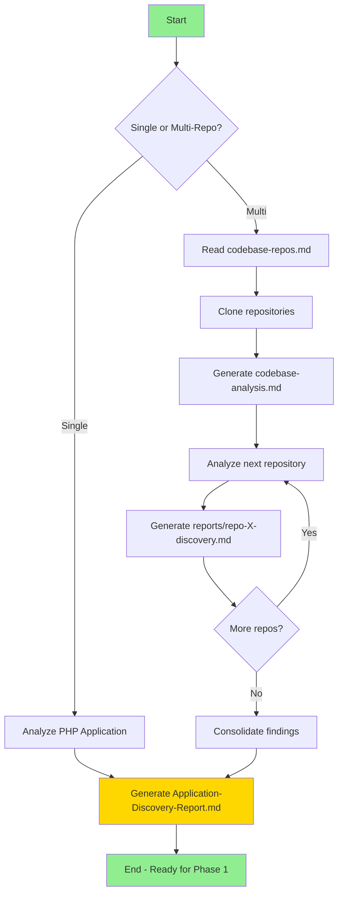
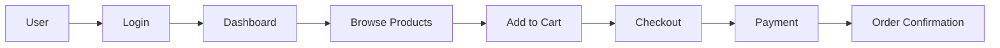

# Phase 0: PHP Application Discovery & Understanding

## Objective

Thoroughly analyze and document PHP application(s) to understand **what the application does**, its components, business logic, and behavior. This phase creates the foundation for the migration to .NET 10.

**Goal**: Before we can migrate, we must fully understand the existing PHP application.

## Context

This prompt works with PHP repositories (single or multi-repo). The analysis produces comprehensive documentation about:
- What the application does (features, user journeys)
- How it's structured (components, architecture)
- Business logic location and flow
- All dependencies and integrations

## Workflow



---

## Step 1: PHP Framework Detection

First, identify what type of PHP application we're dealing with:

### 1.1 Detect PHP Framework

Use `file_search` and `grep_search` to identify the framework:

| Framework | Detection Pattern |
|-----------|------------------|
| **Laravel** | `artisan` file, `composer.json` with `laravel/framework`, `app/Http/Controllers/` |
| **Symfony** | `symfony.lock`, `composer.json` with `symfony/`, `config/bundles.php` |
| **CodeIgniter** | `system/` folder, `CodeIgniter` in index.php |
| **CakePHP** | `composer.json` with `cakephp/cakephp`, `config/app.php` |
| **Yii** | `composer.json` with `yiisoft/yii2` |
| **WordPress** | `wp-config.php`, `wp-content/`, `wp-admin/` |
| **Drupal** | `core/` folder, `sites/default/settings.php` |
| **Vanilla PHP** | No framework markers, custom structure |

### 1.2 Detect PHP Version

```bash
# Check composer.json for PHP version requirement
grep_search: "php" in composer.json
# Look for: "php": "^8.1" or similar
```

### 1.3 Detect Application Type

| Type | Indicators |
|------|------------|
| **Web Application** | Views/templates, sessions, forms |
| **REST API** | JSON responses, no views, API routes |
| **Admin Panel** | CRUD operations, dashboard views |
| **E-commerce** | Cart, checkout, products, payments |
| **CMS** | Content management, pages, posts |
| **Microservice** | Single responsibility, message queues |

---

## Step 2: Component Discovery

### 2.1 Controllers & Routes

**For Laravel:**
```
file_search: app/Http/Controllers/**/*.php
file_search: routes/web.php, routes/api.php
```

**For Symfony:**
```
file_search: src/Controller/**/*.php
file_search: config/routes.yaml, config/routes/*.yaml
```

**For Vanilla PHP:**
```
file_search: **/controller*.php, **/Controller*.php
grep_search: "$_GET|$_POST|$_REQUEST"
```

**Document each controller:**
| Controller | File Path | Actions/Methods | Routes | Purpose |
|------------|-----------|-----------------|--------|---------|
| UserController | app/Http/Controllers/UserController.php | index, show, store, update, delete | /users/* | User CRUD operations |

### 2.2 Models & Entities (Data Layer)

**For Laravel (Eloquent):**
```
file_search: app/Models/**/*.php
file_search: app/*.php (older Laravel)
grep_search: "extends Model"
```

**For Symfony (Doctrine):**
```
file_search: src/Entity/**/*.php
grep_search: "@ORM\\Entity|#[ORM\\Entity]"
```

**Document each model:**
| Model | File Path | Table | Relationships | Key Fields | Business Rules |
|-------|-----------|-------|---------------|------------|----------------|
| User | app/Models/User.php | users | hasMany(Order), belongsTo(Role) | id, email, password, role_id | Email unique, soft deletes |

### 2.3 Services & Business Logic

**This is CRITICAL for migration** - identify where business logic lives:

```
file_search: app/Services/**/*.php
file_search: app/Repositories/**/*.php
file_search: src/Service/**/*.php
file_search: **/services/**/*.php
grep_search: "class.*Service"
```

**Document each service:**
| Service | File Path | Responsibility | Dependencies | Key Methods | Business Rules |
|---------|-----------|----------------|--------------|-------------|----------------|
| PaymentService | app/Services/PaymentService.php | Process payments | StripeGateway, OrderRepository | processPayment(), refund() | Validate card, check limits |

### 2.4 Views & UI Components

**For Laravel (Blade):**
```
file_search: resources/views/**/*.blade.php
file_search: resources/views/layouts/*.blade.php
file_search: resources/views/components/*.blade.php
```

**For Symfony (Twig):**
```
file_search: templates/**/*.twig
file_search: templates/**/*.html.twig
```

**Document UI structure:**
| View/Template | File Path | Layout | Components Used | Purpose |
|---------------|-----------|--------|-----------------|---------|
| dashboard.blade.php | resources/views/dashboard.blade.php | app.blade.php | sidebar, chart, table | Main user dashboard |

### 2.5 Middleware & Filters

```
file_search: app/Http/Middleware/**/*.php
grep_search: "implements Middleware|extends Middleware"
```

**Document middleware:**
| Middleware | File Path | Applied To | Purpose |
|------------|-----------|------------|---------|
| AuthMiddleware | app/Http/Middleware/Authenticate.php | All protected routes | Verify user authentication |

### 2.6 Database Migrations & Schema

```
file_search: database/migrations/**/*.php
file_search: migrations/**/*.php
```

**Document database structure:**
| Table | Migration File | Columns | Indexes | Foreign Keys |
|-------|---------------|---------|---------|--------------|
| users | 2024_01_01_create_users_table.php | id, email, password, created_at | email (unique) | - |

### 2.7 Background Jobs & Workers

```
file_search: app/Jobs/**/*.php
file_search: app/Console/Commands/**/*.php
grep_search: "implements ShouldQueue"
grep_search: "class.*Command.*extends"
```

**Document jobs:**
| Job/Command | File Path | Trigger | Purpose | Schedule |
|-------------|-----------|---------|---------|----------|
| SendEmailJob | app/Jobs/SendEmailJob.php | Queue | Send transactional emails | On-demand |
| CleanupCommand | app/Console/Commands/Cleanup.php | Scheduler | Remove old records | Daily 2am |

### 2.8 Third-Party Packages (Composer)

```
read_file: composer.json (dependencies section)
read_file: composer.lock (for exact versions)
```

**Document key packages:**
| Package | Version | Purpose | .NET Equivalent |
|---------|---------|---------|-----------------|
| stripe/stripe-php | ^10.0 | Payment processing | Stripe.net |
| tymon/jwt-auth | ^2.0 | JWT authentication | Microsoft.AspNetCore.Authentication.JwtBearer |
| intervention/image | ^2.7 | Image manipulation | ImageSharp |

---

## Step 3: Business Logic Analysis

### 3.1 Feature Inventory

Create a complete list of what the application does:

**User-Facing Features:**
| Feature | Description | Components Involved | Priority |
|---------|-------------|---------------------|----------|
| User Registration | New users can sign up | UserController, User model, RegisterForm view | High |
| Product Search | Search products by name/category | ProductController, SearchService, search.blade.php | High |

**Admin Features:**
| Feature | Description | Components Involved | Priority |
|---------|-------------|---------------------|----------|
| User Management | CRUD for users | Admin/UserController, admin/users/*.blade.php | Medium |

### 3.2 User Journeys

Document the main user flows:



### 3.3 Business Rules Location

**CRITICAL**: Document where each business rule is implemented:

| Business Rule | Description | File Location | Method |
|---------------|-------------|---------------|--------|
| Order minimum | Orders must be > $10 | app/Services/OrderService.php | validateOrder() |
| Password policy | Min 8 chars, 1 number | app/Rules/PasswordRule.php | passes() |
| Discount logic | 10% off orders > $100 | app/Services/DiscountService.php | calculateDiscount() |

---

## Step 4: Integration & Dependencies

### 4.1 External APIs

```
grep_search: "Http::get|Http::post|curl_init|Guzzle|file_get_contents.*http"
grep_search: "new Client|GuzzleHttp"
```

**Document external integrations:**
| API | Purpose | Endpoint Pattern | Auth Method | Used In |
|-----|---------|-----------------|-------------|---------|
| Stripe | Payments | api.stripe.com | API Key | PaymentService |
| SendGrid | Email | api.sendgrid.com | API Key | EmailService |

### 4.2 Database Connections

```
grep_search: "DB::|Eloquent|PDO|mysqli"
read_file: config/database.php or .env
```

**Document database usage:**
| Database | Type | Purpose | Connection Name |
|----------|------|---------|-----------------|
| Main DB | MySQL 8.0 | Application data | mysql |
| Cache | Redis | Session & cache | redis |

### 4.3 File Storage

```
grep_search: "Storage::|move_uploaded_file|file_put_contents"
```

### 4.4 Queue/Message Systems

```
grep_search: "Queue::|dispatch|ShouldQueue"
grep_search: "RabbitMQ|Kafka|SQS|Redis.*queue"
```

---

## Step 5: Configuration & Environment

### 5.1 Environment Variables

```
read_file: .env.example
grep_search: "env\(|getenv\(|$_ENV"
```

**Document all environment variables:**
| Variable | Purpose | Required | Default | Sensitive |
|----------|---------|----------|---------|-----------|
| APP_KEY | Encryption key | Yes | - | Yes |
| DB_HOST | Database host | Yes | localhost | No |
| STRIPE_SECRET | Stripe API key | Yes | - | Yes |

### 5.2 Configuration Files

| Config File | Purpose | Key Settings |
|-------------|---------|--------------|
| config/app.php | App settings | timezone, locale, providers |
| config/database.php | DB connections | connections, migrations |
| config/auth.php | Authentication | guards, providers, passwords |

---

## Step 6: Generate Discovery Report

Create `reports/Application-Discovery-Report.md` with the following structure:

```markdown
# Application Discovery Report

**Application Name**: [Name]
**Analysis Date**: [Date]
**PHP Version**: [Version]
**Framework**: [Framework + Version]
**Application Type**: [Web App/API/Admin Panel/etc.]

## Executive Summary

[2-3 paragraphs describing what this application does, who uses it, and its core purpose]

## Application Architecture

### Architecture Diagram

[Mermaid diagram showing components and their relationships]

### Technology Stack

| Layer | Technology |
|-------|------------|
| Frontend | Blade/Twig + Bootstrap/Tailwind |
| Backend | Laravel 10 / PHP 8.2 |
| Database | MySQL 8.0 |
| Cache | Redis |
| Queue | Redis/SQS |

## Component Inventory

### Controllers ([Count])
[Table of all controllers]

### Models ([Count])
[Table of all models with relationships]

### Services ([Count])
[Table of all services with business logic]

### Views ([Count])
[Table of all views/templates]

### Middleware ([Count])
[Table of all middleware]

### Jobs & Commands ([Count])
[Table of background processes]

## Feature Inventory

### User Features
[Complete list with components]

### Admin Features
[Complete list with components]

## Business Logic Map

[Table mapping business rules to files and methods]

## External Integrations

[Table of all external APIs and services]

## Database Schema

### Entity Relationship Diagram

[Mermaid ER diagram]

### Tables Summary
[Table list with key columns and relationships]

## Environment & Configuration

[Environment variables and config files]

## Complexity Assessment

| Area | Complexity | Notes |
|------|------------|-------|
| Controllers | Medium | 15 controllers, standard CRUD |
| Business Logic | High | Complex discount and pricing rules |
| UI | Medium | 45 Blade templates |
| Integrations | Low | 2 external APIs |

## Ready for Phase 1

This application is now documented and ready for technical assessment.

**Next Step**: Run `/phase1-technicalassessment` to gather migration preferences and create the technical assessment report.
```

---

## Multi-Repository Support

For solutions with multiple repositories, repeat the analysis for each repo and create:

1. Individual reports: `reports/[repo-name]-discovery.md`
2. Consolidated summary: `reports/Application-Discovery-Summary.md`

### Multi-Repo Workflow

1. **Read `codebase-repos.md`** with repository URLs
2. **Clone all repositories** to `repos/` folder
3. **Create `codebase-analysis.md`** as task tracker
4. **Analyze ONE repository at a time** (avoid context overflow)
5. **Generate individual discovery report** for each
6. **Consolidate** into summary with cross-repo dependencies

---

## Rules & Constraints

### Analysis Rules
- Analyze **ONE repository at a time** to avoid context overflow
- Read **2000 lines at a time** for sufficient context
- Use `semantic_search` for cross-file pattern discovery
- Document **ALL components** - don't skip any

### Documentation Rules
- Create reports in `reports/` folder
- Use Mermaid diagrams for visualizations
- Make reports human-readable with clear formatting
- Include file paths for all documented components

### Business Logic Priority
- **CRITICAL**: Identify all business logic locations
- Document business rules with file paths and method names
- This information is essential for Phase 2 (Migration Planning)

### Do NOT
- Do NOT start migration planning in this phase
- Do NOT assess technical risks yet (Phase 1)
- Do NOT make recommendations yet
- Focus ONLY on understanding and documenting

---

## Deliverables

At the end of Phase 0, you should have:

1. ✅ `reports/Application-Discovery-Report.md` - Complete application understanding
2. ✅ All components documented with file paths
3. ✅ Business logic mapped to specific files and methods
4. ✅ Feature inventory with component relationships
5. ✅ Architecture diagrams (Mermaid)
6. ✅ Database schema documented

**Next Step**: Proceed to `/phase1-technicalassessment` to gather user preferences and create the technical assessment.
