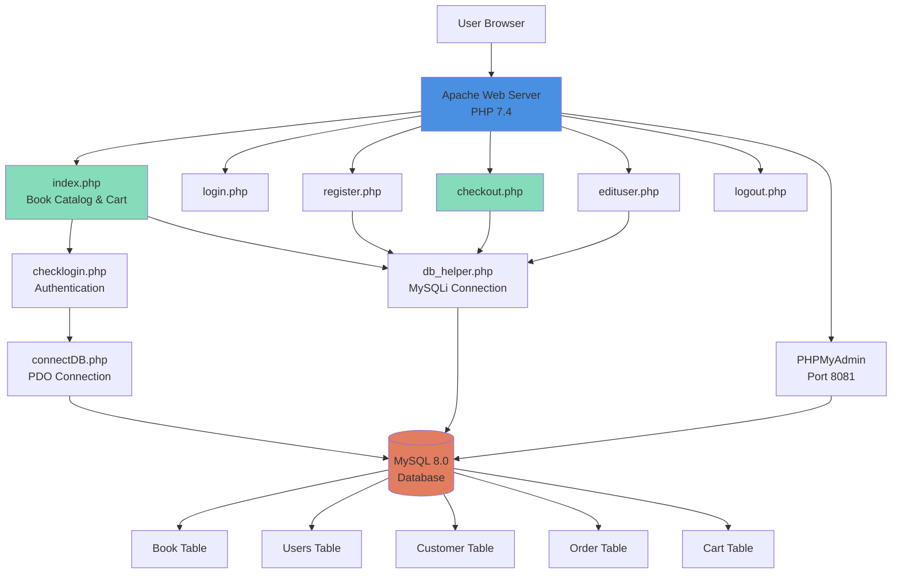
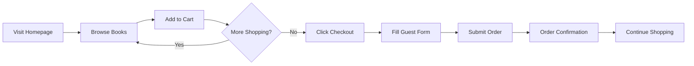
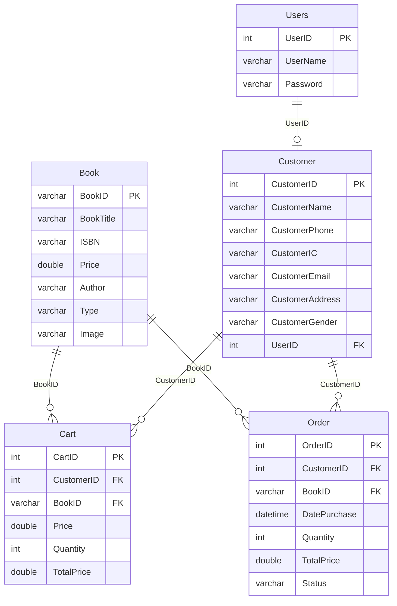

# Application Discovery Report

**Application Name**: PHP Bookstore Website  
**Analysis Date**: January 22, 2026  
**PHP Version**: PHP 7.4  
**Framework**: Vanilla PHP (No Framework)  
**Application Type**: E-commerce Web Application  
**Database**: MySQL 8.0  
**Repository**: RobertoBorges/PHP-Bookstore-Website-Example  

---

## Executive Summary

The PHP Bookstore Website is a simple e-commerce web application built with vanilla PHP 7.4 and MySQL 8.0. This application allows users to browse a catalog of books, add items to a shopping cart, register accounts, login, edit their profiles, and complete purchases. The application uses server-side rendered HTML with embedded PHP and provides guest checkout functionality for non-registered users.

The system follows a traditional PHP architecture with separate page files for each major function (index, login, register, checkout, etc.). Database operations are performed using both MySQLi and PDO extensions, with business logic embedded directly within page files. The application uses PHP sessions for user authentication and state management. There is no REST API layer - all interactions are traditional form-based POST/GET requests.

The application is containerized using Docker with three services: PHP 7.4 with Apache web server, MySQL 8.0 database, and PHPMyAdmin for database management. The database schema includes 5 tables (Book, Users, Customer, Order, Cart) with foreign key relationships to maintain data integrity.

---

## Application Architecture

### Architecture Diagram



### Technology Stack

| Layer | Technology | Version |
|-------|------------|---------|
| Frontend | HTML + Embedded PHP | - |
| Styling | CSS3 + Font Awesome | 4.7.0 |
| Backend | PHP | 7.4 |
| Web Server | Apache | (via php:7.4-apache) |
| Database | MySQL | 8.0 |
| Database Driver | MySQLi + PDO | Native |
| Session Management | PHP Sessions | Native |
| Container Platform | Docker + Docker Compose | 3.8 |
| Database Admin | PHPMyAdmin | Latest |

---

## Component Inventory

### PHP Files (9 Total)

| File | Type | Lines | Purpose | Dependencies |
|------|------|-------|---------|-------------|
| index.php | Page/Controller | ~200 | Main page - displays book catalog, shopping cart, add to cart functionality | db_helper.php, session |
| login.php | Page/View | ~30 | Login form page | - |
| checklogin.php | Controller | ~30 | Processes login authentication | connectDB.php, session |
| register.php | Page/Controller | ~200 | User registration form and processing | db_helper.php, session |
| checkout.php | Page/Controller | ~330 | Checkout processing for logged-in and guest users, order summary | db_helper.php, session |
| edituser.php | Page/Controller | ~174 | Edit user profile form and processing | db_helper.php, session |
| logout.php | Controller | ~5 | Destroys session and redirects to homepage | session |
| connectDB.php | Database Layer | ~10 | PDO database connection helper | PDO |
| db_helper.php | Database Layer | ~15 | MySQLi database connection helper function | MySQLi |

### Database Connection Patterns

**Two Connection Methods Used:**

1. **PDO (connectDB.php)** - Used by: checklogin.php
   - Prepared statements with parameter binding
   - Better security (SQL injection protection)

2. **MySQLi (db_helper.php)** - Used by: index.php, register.php, checkout.php, edituser.php
   - Direct query execution
   - **SECURITY RISK**: String concatenation in SQL queries (SQL injection vulnerable)

### Static Assets

| Asset Type | Files |
|------------|-------|
| CSS | style.css (121 lines) |
| Images | logo.png, logo.gif, travel.jpg, food.jpg, technical.jpg, technology.jpg, bg.gif, loading.svg |
| External Libraries | Font Awesome 4.7.0 (CDN) |

---

## Feature Inventory

### User-Facing Features

| Feature | Description | Components Involved | Priority | Status |
|---------|-------------|---------------------|----------|--------|
| **Browse Books** | Display catalog of available books with images, prices, ISBN, author, type | index.php, Book table | High | ✅ Working |
| **Add to Cart** | Add books to shopping cart with quantity selection | index.php (POST handler), Cart table | High | ✅ Working |
| **View Cart** | Display cart items with images, quantities, prices, and total | index.php (sidebar), Cart table, Book table | High | ✅ Working |
| **Empty Cart** | Remove all items from shopping cart | index.php (POST delc), Cart table | Medium | ✅ Working |
| **User Registration** | Create new account with full profile information | register.php, Users table, Customer table | High | ✅ Working |
| **User Login** | Authenticate existing users | login.php, checklogin.php, Users table | High | ✅ Working |
| **User Logout** | End user session | logout.php | High | ✅ Working |
| **Edit Profile** | Update user information and credentials | edituser.php, Customer table, Users table | Medium | ✅ Working |
| **Checkout (Registered)** | Complete purchase as logged-in user | checkout.php (session path), Order table | High | ✅ Working |
| **Checkout (Guest)** | Complete purchase without account | checkout.php (form path), Customer table, Order table | High | ✅ Working |
| **Order Confirmation** | Display order summary after purchase | checkout.php (success view) | High | ✅ Working |

### User Journeys

#### Journey 1: Guest Purchase Flow


#### Journey 2: Registered User Flow


#### Journey 3: New User Registration


---

## Business Logic Map

### Critical Business Rules

| Business Rule | Description | Location | Method/Logic | Implementation Notes |
|---------------|-------------|----------|--------------|---------------------|
| **Cart Calculation** | TotalPrice = Price * Quantity | index.php | SQL: `Price * Quantity` | Calculated in database INSERT |
| **Order Creation** | Cart items converted to Orders on checkout | checkout.php | Lines 20-31, 137-147 | Loop through Cart, INSERT into Order, DELETE from Cart |
| **Guest Customer Creation** | New Customer record created for guest checkout | checkout.php | Lines 140-156 | Customer created before Order |
| **Session Authentication** | User authenticated via session ID | All protected pages | `$_SESSION['id']` check | Session contains UserID |
| **Password Storage** | Passwords stored in plain text | register.php, edituser.php | Direct string storage | **SECURITY RISK** |
| **Order Status** | Status 'N' = pending, 'y' = completed | checkout.php | Lines 87, 138, 291, 321 | Updated after confirmation |
| **Customer Association** | Cart items linked to CustomerID on checkout | checkout.php | Lines 18-19, 155-156 | UPDATE Cart SET CustomerID |
| **Input Validation** | Name (letters/spaces), IC (numbers/dashes), Email, Phone (numbers/dashes) | register.php, edituser.php, checkout.php | preg_match patterns | Nested if/else validation |
| **Form Sanitization** | test_input() function for XSS prevention | register.php, edituser.php, checkout.php | Lines 183-188 (register.php) | trim, stripcslashes, htmlspecialchars |
| **User-Customer Relationship** | One User can have one Customer profile | register.php | Lines 79-93 | Foreign key UserID in Customer table |

### Validation Rules

| Field | Validation Rule | Pattern | Error Message |
|-------|----------------|---------|---------------|
| Name | Letters and spaces only | `/^[a-zA-Z ]*$/` | "Only letters and white space allowed" |
| IC Number | Numbers and dashes | `/^[0-9 -]*$/` | "Please enter a valid IC number" |
| Email | Valid email format | `filter_var()` | "Invalid email format" |
| Phone | Numbers and dashes | `/^[0-9 -]*$/` | "Please enter a valid phone number" |
| Gender | Required selection | Radio button | "* Gender is required!" |
| Password | Any characters | None | **SECURITY RISK: No policy** |
| Username | Any characters | None | **SECURITY RISK: No validation** |

---

## Database Schema

### Entity Relationship Diagram



### Tables Summary

| Table | Primary Key | Columns | Relationships | Purpose |
|-------|-------------|---------|---------------|---------|
| **Book** | BookID (varchar) | 7 columns | Referenced by Cart, Order | Product catalog |
| **Users** | UserID (int, auto) | 3 columns | References Customer (1:1) | Authentication |
| **Customer** | CustomerID (int, auto) | 8 columns | Referenced by Cart, Order; References Users | User profiles |
| **Order** | OrderID (int, auto) | 7 columns | References Customer, Book | Purchase records |
| **Cart** | CartID (int, auto) | 6 columns | References Customer, Book | Shopping cart items |

### Table Details

#### Book Table
```sql
BookID varchar(50) PRIMARY KEY
BookTitle varchar(200)
ISBN varchar(20)
Price double(12,2)
Author varchar(128)
Type varchar(128)
Image varchar(128)
```
**Sample Data**: 4 books pre-populated (B-001 to B-004)

#### Users Table
```sql
UserID int AUTO_INCREMENT PRIMARY KEY
UserName varchar(128)
Password varchar(16)  -- ⚠️ SECURITY: Plain text, max 16 chars
```

#### Customer Table
```sql
CustomerID int AUTO_INCREMENT PRIMARY KEY
CustomerName varchar(128)
CustomerPhone varchar(12)
CustomerIC varchar(14)
CustomerEmail varchar(200)
CustomerAddress varchar(200)
CustomerGender varchar(10)
UserID int FOREIGN KEY -> Users.UserID ON DELETE SET NULL
```

#### Order Table
```sql
OrderID int AUTO_INCREMENT PRIMARY KEY
CustomerID int FOREIGN KEY -> Customer.CustomerID ON DELETE SET NULL
BookID varchar(50) FOREIGN KEY -> Book.BookID ON DELETE SET NULL
DatePurchase datetime
Quantity int
TotalPrice double(12,2)
Status varchar(1)  -- 'N' = pending, 'y' = completed
```

#### Cart Table
```sql
CartID int AUTO_INCREMENT PRIMARY KEY
CustomerID int FOREIGN KEY -> Customer.CustomerID ON DELETE SET NULL
BookID varchar(50) FOREIGN KEY -> Book.BookID ON DELETE SET NULL
Price double(12,2)
Quantity int
TotalPrice double(12,2)
```

---

## Environment & Configuration

### Environment Variables

| Variable | Purpose | Required | Default | Used In | Sensitive |
|----------|---------|----------|---------|---------|-----------|
| DB_HOST | Database hostname | Yes | mysql | connectDB.php, db_helper.php | No |
| DB_NAME | Database name | Yes | bookstore | connectDB.php, db_helper.php | No |
| DB_USER | Database username | Yes | bookstore_user | connectDB.php, db_helper.php | No |
| DB_PASSWORD | Database password | Yes | bookstore_pass_123 | connectDB.php, db_helper.php | Yes |
| MYSQL_ROOT_PASSWORD | MySQL root password | Yes | root_password_123 | docker-compose.yml | Yes |
| MYSQL_DATABASE | Database to create | Yes | bookstore | docker-compose.yml | No |
| MYSQL_USER | User to create | Yes | bookstore_user | docker-compose.yml | No |
| MYSQL_PASSWORD | User password | Yes | bookstore_pass_123 | docker-compose.yml | Yes |

### Docker Configuration

**Services (3):**

1. **web** (bookstore_web)
   - Image: php:7.4-apache
   - Port: 8080:80
   - Volume: ./bookstore:/var/www/html
   - Extensions: mysqli, pdo, pdo_mysql

2. **mysql** (bookstore_mysql)
   - Image: mysql:8.0
   - Port: 3306:3306
   - Volume: mysql_data (persistent), database.sql (init script)

3. **phpmyadmin** (bookstore_phpmyadmin)
   - Image: phpmyadmin:latest
   - Port: 8081:80
   - Upload limit: 50M

### Application URLs

| Service | URL | Purpose |
|---------|-----|---------|
| Bookstore | http://localhost:8080 | Main application |
| PHPMyAdmin | http://localhost:8081 | Database management |
| MySQL | localhost:3306 | Direct database connection |

---

## Security Analysis

### Security Vulnerabilities Identified

| Issue | Severity | Location | Impact |
|-------|----------|----------|--------|
| **SQL Injection** | 🔴 Critical | index.php, register.php, edituser.php, checkout.php | Direct string concatenation in SQL queries |
| **Plain Text Passwords** | 🔴 Critical | Users table, register.php, edituser.php, checklogin.php | Passwords stored without hashing |
| **No Password Policy** | 🟠 High | register.php | Weak passwords allowed (max 16 chars) |
| **Session Fixation** | 🟠 High | checklogin.php | No session_regenerate_id() after login |
| **XSS Vulnerability** | 🟡 Medium | All output pages | Minimal output encoding (only in forms) |
| **CSRF Protection** | 🟠 High | All forms | No CSRF tokens |
| **No HTTPS** | 🟡 Medium | Docker config | HTTP only, no SSL/TLS |
| **Exposed Error Messages** | 🟡 Medium | connectDB.php | Database connection errors exposed |
| **No Input Length Validation** | 🟡 Medium | All forms | Buffer overflow potential |
| **Predictable Session IDs** | 🟡 Medium | PHP defaults | Using default PHP session handling |

### Security Best Practices Needed

- ✅ **Input sanitization** (test_input() function exists)
- ❌ **SQL parameterization** (only in checklogin.php with PDO)
- ❌ **Password hashing** (none - plain text storage)
- ❌ **CSRF tokens** (none)
- ⚠️ **Output encoding** (minimal - htmlspecialchars in some places)
- ❌ **HTTPS/SSL** (none)
- ❌ **Rate limiting** (none)
- ❌ **Session security** (no regeneration, no secure flags)

---

## Code Quality Assessment

### Complexity Assessment

| Area | Complexity | Count | Notes |
|------|------------|-------|-------|
| **PHP Files** | Low-Medium | 9 files | Simple procedural code |
| **Business Logic** | Medium | Embedded in pages | No separation of concerns |
| **Database Queries** | Medium | ~30 queries | Mix of INSERT, SELECT, UPDATE, DELETE |
| **Validation Logic** | High | Deeply nested | 8+ levels of nested if/else statements |
| **UI Templates** | Medium | Inline HTML | PHP echo statements for HTML generation |
| **Code Reuse** | Low | Minimal | Repeated validation code |
| **Architecture** | Low | Procedural | No MVC, no classes, no OOP |

### Code Patterns

| Pattern | Usage | Assessment |
|---------|-------|------------|
| **Procedural PHP** | All files | ✅ Consistent but outdated |
| **Inline SQL** | Most files | ⚠️ Security risk |
| **Mixed HTML/PHP** | All page files | ⚠️ Hard to maintain |
| **Nested Validation** | register.php, edituser.php, checkout.php | ❌ Poor readability |
| **Session Management** | All protected pages | ✅ Consistent pattern |
| **Error Handling** | Minimal | ❌ No try-catch, minimal validation |
| **Database Abstraction** | None | ❌ Direct SQL queries |

### Technical Debt

1. **No Framework**: Pure procedural PHP limits scalability
2. **No OOP**: No classes, interfaces, or object-oriented design
3. **Repeated Code**: Validation logic duplicated across 3 files
4. **SQL String Concatenation**: Security and maintainability issues
5. **Inline HTML Generation**: echo statements make UI changes difficult
6. **No API Layer**: Tight coupling between presentation and data
7. **Limited Error Handling**: Basic error messages, no logging
8. **No Unit Tests**: No testing infrastructure

---

## Migration Considerations

### Strengths for Migration

✅ **Simple Database Schema** - 5 tables with clear relationships  
✅ **Clear Feature Set** - Well-defined user journeys  
✅ **Small Codebase** - ~1,000 lines of PHP code  
✅ **Docker-Ready** - Already containerized  
✅ **Documented** - README with setup instructions  
✅ **Working Application** - All features functional  

### Challenges for Migration

⚠️ **No Separation of Concerns** - Business logic embedded in views  
⚠️ **Mixed DB Drivers** - Both PDO and MySQLi used  
⚠️ **Security Issues** - Multiple critical vulnerabilities to address  
⚠️ **No Modern Patterns** - No MVC, no REST API, no SPA  
⚠️ **Session-Based Auth** - Will need modern auth (JWT, OAuth)  
⚠️ **Inline HTML** - All HTML generation needs rewriting  

### Migration Complexity Estimate

| Aspect | Complexity | Effort Estimate |
|--------|------------|----------------|
| **Database Migration** | Low | 2-4 hours |
| **Business Logic** | Medium | 8-16 hours |
| **UI/Frontend** | High | 16-24 hours |
| **Authentication** | Medium | 8-12 hours |
| **Security Fixes** | High | 12-20 hours |
| **Testing** | Medium | 12-16 hours |
| **Overall** | **Medium** | **60-90 hours** |

---

## File Structure Overview

```
PHP-Bookstore-Website-Example/
├── docker-compose.yml          # Docker orchestration
├── README.md                   # Documentation
├── README-DOCKER.md           # Docker-specific docs
├── bookstore/
│   ├── checklogin.php         # Authentication handler
│   ├── checkout.php           # Checkout & order processing
│   ├── connectDB.php          # PDO database connection
│   ├── database.sql           # Schema & seed data
│   ├── db_helper.php          # MySQLi connection helper
│   ├── edituser.php           # Profile editing
│   ├── index.php              # Main page - catalog & cart
│   ├── login.php              # Login form
│   ├── logout.php             # Logout handler
│   ├── register.php           # Registration form & handler
│   ├── style.css              # Application styles
│   └── image/                 # Static images
│       ├── logo.png
│       ├── travel.jpg
│       ├── food.jpg
│       ├── technical.jpg
│       └── technology.jpg
└── reports/
    └── Application-Discovery-Report.md  # This document
```

---

## Dependencies

### PHP Extensions
- mysqli
- pdo
- pdo_mysql

### External Libraries
- Font Awesome 4.7.0 (CDN)

### Docker Images
- php:7.4-apache
- mysql:8.0
- phpmyadmin:latest

### No Composer Dependencies
This application does not use Composer or any third-party PHP packages.

---

## Recommendations for .NET 10 Migration

### Architecture Recommendations

1. **Adopt ASP.NET Core MVC Pattern**
   - Controllers: Separate business logic from presentation
   - Models: Entity Framework Core entities
   - Views: Razor Pages or Blazor components

2. **Implement Clean Architecture**
   - Domain Layer: Business entities and rules
   - Application Layer: Use cases and business logic
   - Infrastructure Layer: Database, external services
   - Presentation Layer: Web API or Razor Pages

3. **Database Strategy**
   - Use Entity Framework Core with code-first approach
   - Implement repository pattern
   - Use LINQ for queries (eliminates SQL injection)

4. **Security Enhancements**
   - ASP.NET Core Identity for authentication
   - BCrypt/PBKDF2 for password hashing
   - Built-in CSRF protection
   - HTTPS by default
   - Data annotations for validation
   - Authorization policies

5. **Modern UI Approach**
   - Option 1: Blazor Server (component-based UI)
   - Option 2: Razor Pages (server-rendered)
   - Option 3: React/Vue SPA + Web API backend
   - Option 4: Minimal API + Razor Pages hybrid

### Technology Mapping

| PHP Component | .NET 10 Equivalent |
|---------------|-------------------|
| PHP 7.4 | C# 12 (.NET 10) |
| MySQLi/PDO | Entity Framework Core |
| Sessions | ASP.NET Core Session / JWT |
| index.php | HomeController + Index.cshtml |
| register.php | AccountController + Register.cshtml |
| checklogin.php | AccountController.Login action |
| checkout.php | OrderController + Checkout.cshtml |
| style.css | Bootstrap 5 + custom CSS |
| Plain text passwords | ASP.NET Core Identity (hashed) |
| Manual validation | Data Annotations + FluentValidation |
| Docker Compose | Same (multi-stage .NET Dockerfile) |

---

## Ready for Phase 1: Technical Assessment

✅ **Application fully documented**  
✅ **All 9 PHP files analyzed**  
✅ **Database schema mapped (5 tables)**  
✅ **Business logic identified and located**  
✅ **11 user features documented**  
✅ **Security vulnerabilities identified**  
✅ **Architecture patterns understood**  
✅ **Migration complexity estimated**  

### What We Learned

1. **Application Purpose**: E-commerce bookstore with cart and checkout
2. **User Base**: Guest shoppers + registered users
3. **Core Features**: Browse, cart, checkout, user management
4. **Technical State**: Vanilla PHP, procedural, session-based
5. **Database**: MySQL with 5 tables, clear relationships
6. **Security Posture**: Multiple critical vulnerabilities
7. **Migration Path**: Medium complexity, 60-90 hours estimated

---

## Next Steps

**Proceed to Phase 1: Technical Assessment**

Run the command: `/phase1-technicalassessment`

Phase 1 will:
- Gather your migration preferences (UI framework, authentication, hosting)
- Analyze technical risks and mitigation strategies
- Create detailed technical assessment report
- Provide specific recommendations for your requirements
- Estimate detailed effort and timeline

---

**Report Generated**: January 22, 2026  
**Analyzed Files**: 9 PHP files, 1 SQL file, 1 CSS file, Docker configuration  
**Total Lines of Code**: ~1,150 lines  
**Confidence Level**: High - All components analyzed and documented
