# PHP Bookstore Application Discovery Report

**Project:** PHP-Bookstore-Website-Example  
**Date:** January 28, 2026  
**Phase:** 0 - Application Discovery  
**Status:** ✅ Complete

---

## Executive Summary

This is a **vanilla PHP e-commerce bookstore application** using MySQL database, built with a monolithic architecture. The application provides user registration/authentication, book catalog browsing, shopping cart management, and order checkout functionality.

### Key Characteristics
- **Framework:** Vanilla PHP (No framework - procedural PHP with inline HTML)
- **Database:** MySQL 8.0
- **Architecture:** Monolithic, single-tier web application
- **Authentication:** Session-based with custom implementation
- **UI Pattern:** Mixed PHP/HTML with inline CSS
- **Deployment:** Docker Compose (PHP 7.4-Apache, MySQL 8.0, PHPMyAdmin)

---

## Application Architecture

### High-Level Architecture Diagram


---

## Database Schema Analysis

### Entity Relationship Diagram


### Database Tables Inventory

| Table | Purpose | Key Fields | Relationships |
|-------|---------|------------|---------------|
| **Users** | Authentication credentials | UserID (PK), UserName, Password | 1:1 with Customer |
| **Customer** | Customer profile details | CustomerID (PK), UserID (FK) | 1:N with Orders, Cart |
| **Book** | Product catalog | BookID (PK), BookTitle, Price | 1:N with Orders, Cart |
| **Order** | Purchase transactions | OrderID (PK), CustomerID (FK), BookID (FK), Status | N:1 with Customer, Book |
| **Cart** | Shopping cart (temporary) | CartID (PK), CustomerID (FK), BookID (FK) | N:1 with Customer, Book |

### Schema Issues for Migration
1. **Password Storage:** Plain text passwords (VARCHAR(16)) - needs hashing
2. **Status Field:** Single character ('N', 'y') - should be boolean or enum
3. **TotalPrice:** Calculated field in INSERT - should be computed
4. **No Indexes:** Missing indexes on foreign keys and lookup fields
5. **Cart Design:** Cart is persistent in DB - typically should be session-based or have cleanup

---

## File-by-File Component Analysis

### 1. `index.php` - Main Landing Page & Product Catalog
**Lines of Code:** 101  
**Type:** View + Controller + Business Logic

#### Responsibilities
- Display book catalog with images and details
- Shopping cart management (add items, empty cart)
- Real-time cart display with total calculation
- Session-based header navigation (logged in vs guest)

#### Business Logic Locations

| Business Rule | Location | Code Reference |
|---------------|----------|----------------|
| **Add to Cart** | Lines 5-17 | Inserts book with quantity into Cart table |
| **Empty Cart** | Lines 19-23 | Deletes all items from Cart table |
| **Cart Total Calculation** | Lines 85-95 | Loops through cart items, sums TotalPrice |
| **Dynamic Navigation** | Lines 40-58 | Shows Login/Register OR Logout/Edit Profile |

#### SQL Queries
```php
// Line 8: Fetch book details for adding to cart
SELECT * FROM Book WHERE BookID = '{bookId}'

// Line 14: Insert item into cart with calculated price
INSERT INTO Cart(BookID, Quantity, Price, TotalPrice) 
VALUES('{bookId}', {quantity}, {price}, Price * Quantity)

// Line 21: Empty entire cart
DELETE FROM Cart

// Line 27: Fetch all books for catalog display
SELECT * FROM Book

// Line 80: Join Cart and Book for cart display
SELECT Book.BookTitle, Book.Image, Cart.Price, Cart.Quantity, Cart.TotalPrice 
FROM Book,Cart WHERE Book.BookID = Cart.BookID
```

#### Key Features
- ✅ Session management for authenticated users
- ✅ Dynamic catalog rendering from database
- ✅ Inline cart with real-time total
- ❌ No pagination for book catalog
- ❌ No search/filter functionality
- ❌ SQL injection vulnerability (raw POST values)

---

### 2. `login.php` - Login Form View
**Lines of Code:** 27  
**Type:** View Only

#### Responsibilities
- Display login form with username and password fields
- Error message display via query string parameter
- Navigation back to index

#### Error Handling
```php
// Lines 20-28: Error code mapping
$errorMessages = [
    1 => 'Invalid username or password. Please try again.',
    2 => 'Please login.'
];
```

---

### 3. `checklogin.php` - Authentication Handler
**Lines of Code:** 25  
**Type:** Controller + Business Logic

#### Responsibilities
- Validate user credentials against database
- Create session on successful login
- Redirect to index or login with error

#### Business Logic Locations

| Business Rule | Location | Code Reference |
|---------------|----------|----------------|
| **Credential Validation** | Lines 6-22 | PDO prepared statement with username/password check |
| **Session Creation** | Lines 15-16 | Sets $_SESSION['id'] with UserID |
| **Failed Login** | Lines 23 | Redirects to login.php?errcode=1 |

#### SQL Queries (Prepared Statement)
```php
// Lines 8-12: Secure credential check using PDO
SELECT * FROM Users 
WHERE UserName=:username AND Password = :pwd
```

#### Security Observations
- ✅ Uses PDO prepared statements (prevents SQL injection)
- ❌ Passwords stored/compared in plain text
- ❌ No rate limiting or brute force protection
- ❌ No password hashing (bcrypt/argon2)

---

### 4. `register.php` - User Registration
**Lines of Code:** 148  
**Type:** View + Controller + Business Logic

#### Responsibilities
- Display registration form with validation
- Validate all input fields (name, email, IC, phone, gender, address)
- Create User and Customer records
- Automatic login after registration

#### Business Logic Locations

| Business Rule | Location | Code Reference |
|---------------|----------|----------------|
| **Name Validation** | Lines 11-16 | Regex: Letters and spaces only |
| **IC Validation** | Lines 30-34 | Regex: Numbers, spaces, dashes only |
| **Email Validation** | Lines 39-43 | PHP FILTER_VALIDATE_EMAIL (inverted logic bug) |
| **Phone Validation** | Lines 49-53 | Regex: Numbers, spaces, dashes only |
| **Gender Validation** | Lines 59-61 | Required field check |
| **User Creation** | Lines 69-70 | INSERT into Users table |
| **Customer Profile** | Lines 77-79 | INSERT into Customer table linked to UserID |

#### SQL Queries
```php
// Line 69: Create user account
INSERT INTO Users(UserName, Password) 
VALUES('{username}', '{password}')

// Line 72: Get newly created UserID
SELECT UserID FROM Users WHERE UserName = '{username}'

// Line 77: Create customer profile
INSERT INTO Customer(CustomerName, CustomerPhone, CustomerIC, 
                     CustomerEmail, CustomerAddress, CustomerGender, UserID) 
VALUES('{name}', '{phone}', '{ic}', '{email}', '{address}', '{gender}', {userId})
```

#### Validation Rules
- **Name:** Letters and spaces only
- **Username:** Required (no format validation)
- **Password:** Required (no strength requirements)
- **IC:** Numbers, spaces, dashes only
- **Email:** Email format (has a bug - inverted validation logic)
- **Phone:** Numbers, spaces, dashes only
- **Gender:** Required (Male/Female radio button)
- **Address:** Required

#### Issues to Address
- ❌ **Email validation bug:** `filter_var($email, FILTER_VALIDATE_EMAIL)` logic is inverted (line 42)
- ❌ SQL injection vulnerability (direct variable interpolation)
- ❌ No password confirmation field
- ❌ No terms and conditions acceptance
- ❌ No CAPTCHA or bot protection

---

### 5. `edituser.php` - Profile Editor
**Lines of Code:** 178  
**Type:** View + Controller + Business Logic

#### Responsibilities
- Load existing user and customer data
- Display pre-filled form with current values
- Update Users and Customer tables
- Validation similar to registration

#### Business Logic Locations

| Business Rule | Location | Code Reference |
|---------------|----------|----------------|
| **Load Profile Data** | Lines 17-28 | JOIN Users and Customer tables by UserID |
| **Update User** | Lines 107-108 | UPDATE Users table (incomplete SQL) |
| **Update Customer** | Lines 110-113 | UPDATE Customer with new profile data |
| **Session Check** | Implicit | Requires $_SESSION['id'] to be set |

#### SQL Queries
```php
// Lines 17-18: Load user profile
SELECT Users.UserName, Users.Password, Customer.CustomerName, 
       Customer.CustomerIC, Customer.CustomerEmail, Customer.CustomerPhone, 
       Customer.CustomerGender, Customer.CustomerAddress
FROM Users, Customer
WHERE Users.UserID = Customer.UserID AND Users.UserID = {sessionId}

// Line 107: Update user credentials (INCOMPLETE QUERY)
UPDATE Users SET ... WHERE UserID = {sessionId}

// Lines 110-112: Update customer profile
UPDATE Customer 
SET CustomerName = '{name}', CustomerPhone = '{phone}', 
    CustomerIC = '{ic}', CustomerEmail = '{email}', 
    CustomerAddress = '{address}', CustomerGender = '{gender}'
WHERE UserID = {sessionId}
```

#### Critical Bug
- ❌ **Line 107:** UPDATE query has no SET clause - incomplete SQL
- ❌ UPDATE Customer has no WHERE clause - would update ALL customers

---

### 6. `checkout.php` - Order Processing
**Lines of Code:** 264  
**Type:** View + Controller + Business Logic

#### Responsibilities
- Two checkout paths: Authenticated users vs Guest checkout
- Move Cart items to Order table
- Display order confirmation
- Guest users must fill out customer form

#### Business Logic Locations

| Business Rule | Location | Code Reference |
|---------------|----------|----------------|
| **Authenticated Checkout** | Lines 7-30 | Link CustomerID to Cart, create Orders, clear Cart |
| **Guest Checkout** | Lines 121-173 | Create Customer record, then process order |
| **Cart to Order Migration** | Lines 20-24 | Loop Cart items → INSERT into Order table |
| **Order Confirmation Display** | Lines 32-68 | Display customer details and order summary |
| **Status Update** | Lines 72-73 | Mark orders as 'y' (completed) |

#### SQL Queries - Authenticated User Path
```php
// Line 8: Get CustomerID from session
SELECT CustomerID FROM Customer WHERE UserID = {sessionId}

// Line 11: Link cart items to customer
UPDATE Cart SET CustomerID = {customerId} WHERE 1

// Line 13: Get all cart items
SELECT * FROM Cart

// Lines 20-22: Create order for each cart item
INSERT INTO `Order`(CustomerID, BookID, DatePurchase, Quantity, TotalPrice, Status) 
VALUES({customerId}, '{bookId}', CURRENT_TIME, {quantity}, {totalPrice}, 'N')

// Line 24: Clear the cart
DELETE FROM Cart

// Lines 28-31: Fetch order details for confirmation
SELECT Customer.*, Book.*, Order.* 
FROM Customer, Book, `Order`
WHERE Order.CustomerID = Customer.CustomerID 
  AND Order.BookID = Book.BookID 
  AND Order.Status = 'N' 
  AND Order.CustomerID = {customerId}
```

#### SQL Queries - Guest User Path
```php
// Lines 142-144: Create guest customer record
INSERT INTO Customer(CustomerName, CustomerPhone, CustomerIC, 
                     CustomerEmail, CustomerAddress, CustomerGender) 
VALUES('{name}', '{phone}', '{ic}', '{email}', '{address}', '{gender}')

// Lines 146-150: Get newly created CustomerID
SELECT CustomerID FROM Customer 
WHERE CustomerName = '{name}' AND CustomerIC = '{ic}'

// Then follows same Cart → Order flow as authenticated user
```

#### Critical Design Issues
- ❌ **Guest customers pollute Customer table** - no UserID association
- ❌ Status flag 'N' vs 'y' is unclear (should be 'pending', 'completed')
- ❌ No transaction handling - cart could fail to clear if order insert fails
- ❌ Duplicate customer detection relies on Name + IC (weak matching)

---

### 7. `logout.php` - Session Termination
**Lines of Code:** 5  
**Type:** Controller

#### Responsibilities
- Destroy user session
- Redirect to home page

#### Business Logic
```php
// Lines 2-4: Simple session destruction
session_start();
session_destroy();
header("Location:index.php");
```

---

### 8. `connectDB.php` - PDO Database Connection
**Lines of Code:** 9  
**Type:** Infrastructure / Data Access

#### Responsibilities
- Create PDO connection to MySQL
- Load credentials from environment variables
- Set error mode to exceptions

#### Configuration
```php
$db_host = getenv('DB_HOST') ?: 'mysql';
$db_name = getenv('DB_NAME') ?: 'bookstore';
$db_user = getenv('DB_USER') ?: 'bookstore_user';
$db_pass = getenv('DB_PASSWORD') ?: 'bookstore_pass_123';

$pdo = new PDO("mysql:host=$db_host;port=3306;dbname=$db_name", 
               $db_user, $db_pass);
$pdo->setAttribute(PDO::ATTR_ERRMODE, PDO::ERRMODE_EXCEPTION);
```

#### Usage Pattern
- Used by: `checklogin.php` only
- Connection type: PDO (more modern)

---

### 9. `db_helper.php` - MySQLi Database Connection
**Lines of Code:** 14  
**Type:** Infrastructure / Data Access

#### Responsibilities
- Create MySQLi connection to MySQL
- Load credentials from environment variables
- Return connection object

#### Configuration
```php
function getDBConnection() {
    $servername = getenv('DB_HOST') ?: 'mysql';
    $database = getenv('DB_NAME') ?: 'bookstore';
    $username = getenv('DB_USER') ?: 'bookstore_user';
    $password = getenv('DB_PASSWORD') ?: 'bookstore_pass_123';

    $conn = new mysqli($servername, $username, $password, $database);
    
    if ($conn->connect_error) {
        die("Connection failed: " . $conn->connect_error);
    }
    
    return $conn;
}
```

#### Usage Pattern
- Used by: `index.php`, `register.php`, `edituser.php`, `checkout.php`
- Connection type: MySQLi (procedural/object style)
- **Inconsistency:** Application uses both PDO and MySQLi

---

## User Journeys & Business Flows

### Journey 1: Guest User - Browse and Purchase


### Journey 2: Registered User - Login and Purchase

```mermaid
sequenceDiagram
    actor User
    participant Login
    participant CheckLogin
    participant Index
    participant Checkout
    participant Database
    
    User->>Login: Access login page
    User->>CheckLogin: Submit credentials
    CheckLogin->>Database: SELECT FROM Users
    Database-->>CheckLogin: User found
    CheckLogin->>CheckLogin: Create session
    CheckLogin-->>User: Redirect to Index
    
    User->>Index: Browse catalog
    User->>Index: Add books to cart
    Index->>Database: INSERT INTO Cart
    
    User->>Checkout: Click CHECKOUT
    Checkout->>Database: Link Cart to CustomerID
    Checkout->>Database: Move Cart → Order
    Checkout->>Database: Clear Cart
    Checkout-->>User: Order confirmation
```



### Journey 3: User Registration


---

## Critical Business Rules Inventory

### Authentication & Authorization

| Rule ID | Description | Location | Implementation |
|---------|-------------|----------|----------------|
| AUTH-01 | Users must have unique usernames | `register.php` | No explicit check - relies on DB constraint (not defined) |
| AUTH-02 | Passwords must be provided | `register.php:25-27` | Empty check only |
| AUTH-03 | Sessions must persist across pages | All files | PHP $_SESSION['id'] |
| AUTH-04 | Logout destroys session | `logout.php:3-4` | session_destroy() |

### Customer Management

| Rule ID | Description | Location | Implementation |
|---------|-------------|----------|----------------|
| CUST-01 | Customer names: letters and spaces only | `register.php:13-15` | preg_match("/^[a-zA-Z ]*$/") |
| CUST-02 | IC numbers: digits, spaces, dashes only | `register.php:31-33` | preg_match("/^[0-9 -]*$/") |
| CUST-03 | Email must be valid format | `register.php:40-42` | filter_var() - HAS BUG |
| CUST-04 | Phone: digits, spaces, dashes only | `register.php:50-52` | preg_match("/^[0-9 -]*$/") |
| CUST-05 | Gender is required (Male/Female) | `register.php:59-61` | Radio button validation |
| CUST-06 | Address is required | `register.php:63-65` | Empty check |
| CUST-07 | Users have 1:1 relationship with Customer | Schema + `register.php:77` | UserID foreign key |

### Shopping Cart

| Rule ID | Description | Location | Implementation |
|---------|-------------|----------|----------------|
| CART-01 | Cart items include quantity | `index.php:12` | Quantity field in INSERT |
| CART-02 | TotalPrice = Price * Quantity | `index.php:14` | Calculated in SQL INSERT |
| CART-03 | Cart can be emptied | `index.php:21` | DELETE FROM Cart |
| CART-04 | Cart persists in database | Schema | Cart table |
| CART-05 | Cart total displayed real-time | `index.php:85-95` | PHP loop sum |

### Order Processing

| Rule ID | Description | Location | Implementation |
|---------|-------------|----------|----------------|
| ORD-01 | Cart items moved to Order table | `checkout.php:20-22` | INSERT INTO Order loop |
| ORD-02 | Orders linked to customers | `checkout.php:8-11` | CustomerID foreign key |
| ORD-03 | Order date automatically set | `checkout.php:21` | CURRENT_TIME |
| ORD-04 | Cart cleared after checkout | `checkout.php:24` | DELETE FROM Cart |
| ORD-05 | Orders initially marked 'N' status | `checkout.php:22` | Status = 'N' |
| ORD-06 | Orders marked 'y' after display | `checkout.php:72` | UPDATE Status = 'y' |
| ORD-07 | Guest users can checkout | `checkout.php:121-173` | Create Customer inline |

---

## Technical Debt & Security Issues

### 🔴 Critical Security Vulnerabilities

1. **SQL Injection (High Priority)**
   - **Files:** `index.php`, `register.php`, `edituser.php`, `checkout.php`
   - **Issue:** Direct variable interpolation in SQL queries
   - **Example:** `$_POST['ac']` directly used without sanitization
   - **Fix:** Use prepared statements consistently

2. **Plain Text Passwords (High Priority)**
   - **Files:** `register.php`, `checklogin.php`, `edituser.php`
   - **Issue:** Passwords stored without hashing
   - **Fix:** Implement password_hash() and password_verify()

3. **Session Fixation Risk**
   - **Files:** `checklogin.php`
   - **Issue:** No session regeneration after login
   - **Fix:** Call session_regenerate_id(true) after authentication

4. **No CSRF Protection**
   - **Files:** All form handlers
   - **Issue:** No tokens to prevent cross-site request forgery
   - **Fix:** Implement CSRF tokens

### 🟡 Data Integrity Issues

5. **Inconsistent Database Access**
   - **Issue:** Mixed PDO (`checklogin.php`) and MySQLi (all other files)
   - **Impact:** Code inconsistency, harder maintenance
   - **Fix:** Standardize on one method (prefer PDO)

6. **No Transaction Support**
   - **Files:** `checkout.php`, `register.php`
   - **Issue:** Multi-step operations not atomic
   - **Impact:** Data corruption if partial failure
   - **Fix:** Wrap related operations in BEGIN/COMMIT transactions

7. **Incomplete SQL Queries**
   - **File:** `edituser.php:107`
   - **Issue:** UPDATE statement has no SET clause
   - **Impact:** PHP error on profile update

8. **Missing WHERE Clause**
   - **File:** `edituser.php:112`
   - **Issue:** UPDATE Customer with no WHERE - updates all rows
   - **Impact:** Destroys all customer data

### 🟢 Code Quality Issues

9. **Email Validation Bug**
   - **File:** `register.php:42`, `checkout.php:139`
   - **Issue:** `if (filter_var($email, FILTER_VALIDATE_EMAIL))` logic inverted
   - **Impact:** Valid emails rejected, invalid accepted

10. **No Separation of Concerns**
    - **Files:** All PHP files
    - **Issue:** HTML, PHP, SQL mixed in single files
    - **Impact:** Hard to test, maintain, reuse

11. **No Input Sanitization**
    - **Function:** `test_input()` defined but never used
    - **Impact:** XSS vulnerabilities

12. **Weak Customer Identification**
    - **File:** `checkout.php:146`
    - **Issue:** Guest customer lookup by Name + IC only
    - **Impact:** Could match wrong customer or create duplicates

---

## Infrastructure & Deployment

### Current Docker Setup

```yaml
Services:
  - web: PHP 7.4-Apache (port 8080)
  - mysql: MySQL 8.0 (port 3306)
  - phpmyadmin: Database admin tool (port 8081)
```

### Environment Variables
- `DB_HOST` - MySQL hostname (default: 'mysql')
- `DB_NAME` - Database name (default: 'bookstore')
- `DB_USER` - Database user (default: 'bookstore_user')
- `DB_PASSWORD` - Database password (default: 'bookstore_pass_123')

### Volumes
- `./bookstore` → `/var/www/html` (application code)
- `./bookstore/database.sql` → init script
- `mysql_data` → persistent database storage

---

## Application Statistics

| Metric | Value |
|--------|-------|
| **Total PHP Files** | 9 |
| **Total Lines of Code** | ~730 |
| **Database Tables** | 5 |
| **Business Rules** | 25+ documented |
| **User Journeys** | 3 primary flows |
| **Security Vulnerabilities** | 4 critical, 3 high priority |
| **Code Quality Issues** | 8 identified |

---

## Migration Complexity Assessment

### Application Complexity: **Low to Medium**

#### ✅ Migration Advantages
- Simple monolithic architecture
- No framework dependencies
- Straightforward business logic
- Well-defined database schema
- Clear user flows
- Docker-ready infrastructure

#### ⚠️ Migration Challenges
- Mixed database access patterns (PDO + MySQLi)
- Inline HTML makes view extraction harder
- No existing test coverage
- Security issues require addressing during migration
- Status field logic is unclear ('N' vs 'y')
- Guest checkout creates orphan customers

### Recommended .NET 10 Architecture

Based on the application analysis:

1. **ASP.NET Core MVC** (not Minimal APIs)
   - Reason: Application has views, forms, complex user flows
   
2. **Entity Framework Core**
   - Map existing MySQL schema to EF models
   
3. **ASP.NET Core Identity**
   - Replace custom auth with built-in secure authentication
   
4. **Razor Views**
   - Replace PHP/HTML mix with structured Razor templates
   
5. **Azure SQL Database or Azure Database for MySQL**
   - Keep MySQL or migrate to SQL Server
   
6. **Azure App Service or Container Apps**
   - Similar to current Docker setup

---

## Next Steps

✅ **Phase 0 Complete** - Application fully documented

**Ready for Phase 1:** Technical Assessment
- Gather user preferences for .NET architecture
- Assess PHP → .NET migration risks
- Map packages and libraries
- Estimate migration effort

**Command to Continue:** `/phase1-technicalassessment`

---

## Appendices

### A. File Size Analysis
```
index.php:      101 lines (catalog + cart)
checkout.php:   264 lines (order processing)
register.php:   148 lines (user registration)
edituser.php:   178 lines (profile editing)
login.php:       27 lines (login form)
checklogin.php:  25 lines (auth handler)
logout.php:       5 lines (session destroy)
connectDB.php:    9 lines (PDO connection)
db_helper.php:   14 lines (MySQLi connection)
```

### B. Database Field Inventory

**Book Table:** 7 fields (BookID, BookTitle, ISBN, Price, Author, Type, Image)  
**Users Table:** 3 fields (UserID, UserName, Password)  
**Customer Table:** 8 fields (CustomerID, CustomerName, CustomerPhone, CustomerIC, CustomerEmail, CustomerAddress, CustomerGender, UserID)  
**Order Table:** 7 fields (OrderID, CustomerID, BookID, DatePurchase, Quantity, TotalPrice, Status)  
**Cart Table:** 6 fields (CartID, CustomerID, BookID, Price, Quantity, TotalPrice)

---

**Report Generated:** January 28, 2026  
**Agent:** PHP to .NET 10 Migration Agent  
**Next Phase:** Technical Assessment
