# Migration Status Report

**Application**: PHP Bookstore Website  
**Last Updated**: January 22, 2026  
**Target**: .NET 10 on Azure Kubernetes Service  
**Database**: MySQL 8.0 → Azure SQL Database  
**Authentication**: PHP Sessions → Microsoft Entra ID  

---

## Overall Progress

```mermaid
graph LR
    P0[Phase 0<br/>Discovery<br/>✅ 100%] --> P1[Phase 1<br/>Assessment<br/>✅ 100%]
    P1 --> P2[Phase 2<br/>Planning<br/>✅ 100%]
    P2 --> P3[Phase 3<br/>Migration<br/>⏳ 85%]
    P3 --> P4[Phase 4<br/>Infrastructure<br/>⏳ 0%]
    P4 --> P5[Phase 5<br/>Deployment<br/>⏳ 0%]
    P5 --> P6[Phase 6<br/>CI/CD<br/>⏳ 0%]
    
    style P0 fill:#4CAF50,color:#fff
    style P1 fill:#4CAF50,color:#fff
    style P2 fill:#4CAF50,color:#fff
    style P3 fill:#FFC107
    style P4 fill:#9E9E9E
    style P5 fill:#9E9E9E
    style P6 fill:#9E9E9E
```

| Phase | Status | Completion | Duration |
|-------|--------|------------|----------|
| **Phase 0: Application Discovery** | ✅ Complete | 100% | Completed |
| **Phase 1: Technical Assessment** | ✅ Complete | 100% | Completed |
| **Phase 2: Migration Planning** | ✅ Complete | 100% | Completed |
| **Phase 3: Code Migration** | ⏳ In Progress | 85% | Wave 4 (Views) remaining |
| **Phase 4: Infrastructure Generation** | ⏳ Not Started | 0% | ~45 hours |
| **Phase 5: Azure Deployment** | ⏳ Not Started | 0% | ~20 hours |
| **Phase 6: CI/CD Setup** | ⏳ Not Started | 0% | ~10 hours |
| **Testing & Refinement** | ⏳ Not Started | 0% | ~58 hours |

---

## Phase 0 Summary - Application Discovery ✅

**Completed**: January 22, 2026  
**Output**: `reports/Application-Discovery-Report.md`

### Key Findings
- **Application Type**: E-commerce bookstore web application
- **PHP Version**: 7.4 (vanilla PHP, no framework)
- **Components**: 9 PHP files, 5 database tables
- **Lines of Code**: ~1,150 lines
- **Features**: 11 user-facing features identified
- **Database**: MySQL 8.0 with clear relationships

### Components Discovered
- 9 PHP files analyzed
- 5 database tables mapped
- 11 business features documented
- Multiple security vulnerabilities identified
- Architecture diagrams created

---

## Phase 1 Summary - Technical Assessment ✅

**Completed**: January 22, 2026  
**Output**: `reports/Technical-Assessment-Report.md`

### Migration Configuration Confirmed

| Setting | Choice |
|---------|--------|
| **.NET Architecture** | ASP.NET Core MVC |
| **Frontend Strategy** | Razor Views |
| **Data Access** | Entity Framework Core |
| **Authentication** | Microsoft Entra ID (Azure AD) |
| **Azure Hosting** | Azure Kubernetes Service (AKS) |
| **IaC Tool** | Bicep |
| **Database** | Azure SQL Database |

### Risk Assessment Complete

| Risk Level | Count | Status |
|------------|-------|--------|
| 🔴 Critical | 5 | Mitigation strategies defined |
| 🟠 High | 7 | Mitigation strategies defined |
| 🟡 Medium | 7 | Mitigation strategies defined |
| 🟢 Low | 5 | Standard migration approach |

### Key Challenges Identified
1. **Authentication Overhaul** - Complete redesign from sessions to Entra ID (16 hours)
2. **AKS Complexity** - Kubernetes orchestration, networking, ingress (20 hours)
3. **Database Migration** - MySQL to Azure SQL with schema changes (8 hours)
4. **Security Fixes** - Resolve SQL injection, plain text passwords (included in development)
5. **Corporate User Provisioning** - Azure AD user/group setup required

### Effort Estimate

| Category | Hours |
|----------|-------|
| Core Development | 70 |
| Authentication & Security | 36 |
| Infrastructure & DevOps | 45 |
| Testing | 32 |
| Documentation | 6 |
| Contingency (20%) | 38 |
| **Total** | **227 hours** |

**Estimated Timeline**: 6 weeks (40 hours/week)

---

## Phase 2 Summary - Migration Planning ✅

**Completed**: January 22, 2026  
**Output**: `reports/Migration-Plan-Detailed.md`

### Migration Strategy Defined
- 6-wave execution approach
- File-by-file mappings complete
- Business logic preservation checklist with 15 critical rules
- Migration order optimized by dependencies

---

## Phase 3 Summary - Code Migration ⏳ (85% Complete)

**Started**: January 22, 2026  
**Status**: Wave 1-3 Complete, Wave 4 (Razor Views) In Progress

### Waves Completed

#### ✅ Wave 1: Foundation & Setup (100%)
- Created .NET 10 project structure
- Installed NuGet packages (EF Core 10.0.1, Entra ID 3.5.0)
- Created 5 entity models (Book, User, Customer, Order, Cart)
- Created DbContext with relationships and seed data
- Generated EF Core migration (InitialCreate)
- Configured Program.cs with Entra ID + EF Core
- Configured appsettings.json
- **Build Status**: ✅ Successful

#### ✅ Wave 2: Data Layer & Services (100%)
- Created 5 DTOs with validation (AddToCart, Checkout, CartItem, Order, OrderDetails)
- Created 1 ViewModel (BookCatalog)
- Created 3 service interfaces (IBookService, ICartService, IOrderService)
- Created 3 service implementations:
  - **BookService**: Simple CRUD operations
  - **CartService**: Cart management with Price * Quantity logic preserved from PHP
  - **OrderService**: **CRITICAL** transaction-based checkout with cart-to-order conversion
- Registered services in Program.cs dependency injection
- **Build Status**: ✅ Successful

#### ✅ Wave 3: Controllers (100%)
- Created **HomeController**: Book catalog display + Add to cart
- Created **CartController**: View cart, remove items, empty cart
- Created **OrderController**: Checkout (GET/POST), order confirmation, history, details
- All controllers use dependency injection with services
- All controllers use Entra ID authentication (ClaimTypes.NameIdentifier)
- **Build Status**: ✅ Successful (0 errors, 10 warnings - NuGet version only)

### Current Wave

#### ⏳ Wave 4: Razor Views (0%)
**Next Tasks**:
1. Create Views/Home/Index.cshtml - Book catalog with cart sidebar
2. Create Views/Cart/Index.cshtml - Cart management page
3. Create Views/Order/Checkout.cshtml - Checkout form
4. Create Views/Order/Confirmation.cshtml - Order success page
5. Create Views/Order/History.cshtml - Order history
6. Create Views/Order/Details.cshtml - Order details
7. Create Views/Shared/_Layout.cshtml - Main layout with navigation
8. Create Views/Shared/_ValidationScriptsPartial.cshtml

### Pending Waves
- ⏳ Wave 5: Database Migration (0%)
- ⏳ Wave 6: Infrastructure & Testing (0%)

---

## Current Status: Wave 4 (Razor Views) 📋

### What's Next

**Action Required**: Create Razor Views to complete Phase 3

Phase 3 Wave 4 will create all Razor views with:
- Responsive Bootstrap 5 layout
- Client-side validation
- TempData messages for feedback
- Entra ID authentication UI integration
- Migration of PHP HTML to Razor syntax

---

## Prerequisites Checklist

Before starting Phase 3 (Code Migration), ensure:

### Development Environment
- [ ] .NET 10 SDK installed
- [ ] Visual Studio 2025 or VS Code with C# Dev Kit
- [ ] Docker Desktop running
- [ ] Azure CLI authenticated
- [ ] kubectl installed

### Azure Prerequisites
- [ ] Azure subscription with appropriate permissions
- [ ] Azure AD tenant access
- [ ] Permission to create app registrations
- [ ] AKS quota available (5+ cores)

### Planning & Access
- [ ] Corporate customer list for user provisioning
- [ ] Azure AD group structure defined
- [ ] DNS domain available (optional)
- [ ] SSL certificate plan

---

## Architecture Overview

### Current (PHP)
- Vanilla PHP 7.4 with Apache
- MySQL 8.0 database
- Session-based authentication
- Server-side rendered HTML
- Docker containerized

### Target (.NET 10)
- ASP.NET Core MVC
- Azure SQL Database
- Microsoft Entra ID authentication
- Razor Views
- Azure Kubernetes Service (AKS)
- Bicep infrastructure
- Entity Framework Core

---

## Key Metrics

| Metric | Value |
|--------|-------|
| **Total PHP Files** | 9 |
| **Lines of PHP Code** | ~1,150 |
| **Database Tables** | 5 |
| **User Features** | 11 |
| **Controllers to Create** | 4 (Home, Cart, Order, Account) |
| **Services to Create** | 3 (Book, Cart, Order) |
| **Razor Views to Create** | 6 |
| **EF Core Entities** | 5 |
| **Kubernetes Manifests** | 7 |
| **Critical Risks** | 5 |
| **High Risks** | 7 |
| **Estimated Effort** | 227 hours |
| **Target Timeline** | 6 weeks |

---

## Migration Approach

### Wave-Based Migration (To be detailed in Phase 2)

**Wave 1**: Foundation
- .NET project setup
- Database entities
- DbContext configuration

**Wave 2**: Core Features
- Book catalog
- Shopping cart

**Wave 3**: User Management
- Entra ID integration
- Profile management

**Wave 4**: Orders & Checkout
- Order processing
- Checkout flow

**Wave 5**: Infrastructure
- Bicep templates
- Kubernetes manifests

**Wave 6**: Deployment & Testing
- Deploy to AKS
- End-to-end validation

---

## Risk Mitigation Status

| Risk | Mitigation | Status |
|------|------------|--------|
| SQL Injection | Use EF Core parameterized queries | ✅ Planned |
| Plain Text Passwords | Entra ID (no password storage) | ✅ Planned |
| Session Fixation | Token-based authentication | ✅ Planned |
| AKS Complexity | Use Bicep best practices | ✅ Planned |
| Database Migration | Test in dev first, backup production | ✅ Planned |
| User Provisioning | Document onboarding process | ⏳ To be documented in Phase 4 |

---

## Documentation Status

| Document | Status | Location |
|----------|--------|----------|
| Application Discovery Report | ✅ Complete | `reports/Application-Discovery-Report.md` |
| Technical Assessment Report | ✅ Complete | `reports/Technical-Assessment-Report.md` |
| Migration Plan (Detailed) | ⏳ Pending | `reports/Migration-Plan-Detailed.md` |
| Status Report | ✅ Current | `reports/Report-Status.md` |

---

## Next Action

🎯 **Ready to proceed with detailed migration planning**

Run: **`/phase2-createmigrationplan`**

This will create the comprehensive file-by-file migration plan with method-level mappings and wave-by-wave execution strategy.

---

**Last Updated**: January 22, 2026  
**Current Phase**: Completed Phase 1, Ready for Phase 2  
**Overall Status**: On Track ✅
