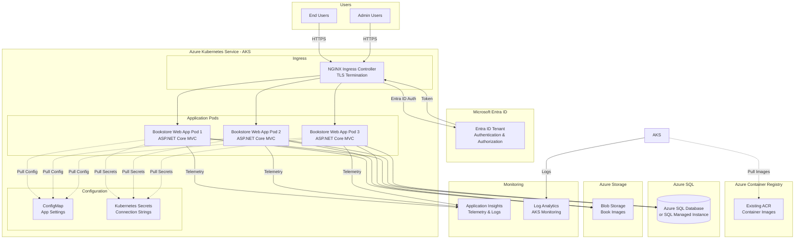

# Technical Assessment Report - PHP to .NET 10 Migration

**Project:** PHP-Bookstore-Website-Example  
**Date:** January 28, 2026  
**Phase:** 1 - Technical Assessment  
**Status:** ✅ Complete

---

## Executive Summary

This report documents the technical assessment for migrating the PHP Bookstore application to .NET 10 on Azure Kubernetes Service (AKS). Based on user preferences and existing Azure infrastructure, we will implement a **moderate modernization approach** that fixes security vulnerabilities while preserving core business logic.

### User-Selected Architecture

| Decision Area | Selected Option | Rationale |
|---------------|----------------|-----------|
| **Hosting Platform** | Azure Kubernetes Service (AKS) | Existing AKS infrastructure available, provides scalability and container orchestration |
| **Database** | Azure SQL Database | Existing SQL Server available, better Azure integration, T-SQL features |
| **Authentication** | Microsoft Entra ID | Existing Entra ID setup, enterprise-grade security, SSO capabilities |
| **Frontend** | Razor Pages/MVC | Server-side rendering, familiar pattern, SEO-friendly |
| **IaC Tool** | Bicep | Azure-native, type-safe, simpler than ARM templates |
| **Migration Style** | Moderate Modernization | Fix security issues, improve architecture, preserve business logic |

### Existing Infrastructure to Leverage

✅ **Azure Container Registry (ACR)** - Will push .NET container images here  
✅ **Azure Kubernetes Service (AKS)** - Target deployment platform  
✅ **Microsoft Entra ID** - Authentication and authorization  
✅ **SQL Server** - Will use Azure SQL Database or SQL MI

---

## Target Architecture

### High-Level .NET 10 Architecture



---

## .NET 10 Technology Stack

### Application Layer

| Component | Technology | Version | Purpose |
|-----------|-----------|---------|---------|
| **Framework** | ASP.NET Core | .NET 10 | Web application framework |
| **UI Pattern** | Razor Pages / MVC | .NET 10 | Server-side HTML generation |
| **Data Access** | Entity Framework Core | 10.0 | ORM for database operations |
| **Authentication** | Microsoft.Identity.Web | Latest | Entra ID integration |
| **Logging** | Microsoft.Extensions.Logging | .NET 10 | Structured logging |
| **Configuration** | Microsoft.Extensions.Configuration | .NET 10 | Settings management |

### Database Layer

| Component | Technology | Notes |
|-----------|-----------|-------|
| **Database Engine** | Azure SQL Database | Existing SQL Server infrastructure |
| **EF Core Provider** | Microsoft.EntityFrameworkCore.SqlServer | 10.0 |
| **Migration Tool** | EF Core Migrations | Code-first migrations |
| **Connection Pooling** | Built-in ADO.NET pooling | Default configuration |

### Container & Orchestration

| Component | Technology | Notes |
|-----------|-----------|-------|
| **Container Runtime** | Docker | Multi-stage Dockerfile |
| **Base Image** | mcr.microsoft.com/dotnet/aspnet:10.0 | Official .NET runtime |
| **Container Registry** | Azure Container Registry (ACR) | **Existing infrastructure** |
| **Orchestration** | Azure Kubernetes Service (AKS) | **Existing infrastructure** |
| **Ingress Controller** | NGINX Ingress | TLS termination, routing |
| **Service Mesh** | Optional - Linkerd/Istio | Consider for advanced scenarios |

### Authentication & Security

| Component | Technology | Notes |
|-----------|-----------|-------|
| **Identity Provider** | Microsoft Entra ID | **Existing setup** |
| **Auth Library** | Microsoft.Identity.Web | Entra ID integration |
| **Authorization** | ASP.NET Core Authorization | Role-based and policy-based |
| **Secrets Management** | Azure Key Vault + K8s Secrets | Hybrid approach |
| **TLS/SSL** | Let's Encrypt + cert-manager | Automatic certificate management |

### Monitoring & Observability

| Component | Technology | Notes |
|-----------|-----------|-------|
| **APM** | Application Insights | Distributed tracing, metrics |
| **Container Logs** | Log Analytics | AKS integration |
| **Metrics** | Prometheus (optional) | Kubernetes-native metrics |
| **Dashboards** | Azure Monitor Workbooks | Pre-built AKS dashboards |

---

## PHP to .NET 10 Migration Mapping

### Architecture Pattern Migration

| PHP Pattern | .NET 10 Pattern | Migration Notes |
|-------------|-----------------|-----------------|
| Procedural PHP files | ASP.NET Core MVC Controllers | Extract logic to controllers and services |
| Mixed PHP/HTML | Razor Views (.cshtml) | Separate concerns: C# in views via @ syntax |
| `session_start()` | ASP.NET Core Session Middleware | Built-in session management |
| `$_POST`, `$_GET` | Model Binding | Automatic binding to C# models |
| `require_once` | Dependency Injection | Constructor injection pattern |
| Global variables | Scoped services | DI container with proper lifetimes |

### Database Access Migration

| PHP Approach | .NET 10 Approach | Example |
|--------------|------------------|---------|
| **Raw SQL (MySQLi)** | **EF Core + LINQ** | `context.Books.Where(b => b.BookId == id)` |
| `$conn->query($sql)` | `await context.SaveChangesAsync()` | Async/await pattern |
| `fetch_assoc()` | `ToListAsync()`, `FirstOrDefaultAsync()` | Type-safe, async operations |
| String concatenation | Parameterized queries | Built-in SQL injection prevention |
| Transaction: manual BEGIN/COMMIT | `using var transaction = await context.Database.BeginTransactionAsync()` | Automatic rollback on exception |

### Authentication Migration

| PHP (Custom) | .NET 10 (Entra ID) | Implementation |
|--------------|-------------------|----------------|
| **Password storage** | N/A - Managed by Entra ID | No password in database |
| `$_SESSION['id']` | Claims-based authentication | User claims in HTTP context |
| `checklogin.php` | Entra ID redirect flow | OpenID Connect middleware |
| Plain text passwords | Entra ID manages credentials | Enterprise-grade security |
| Session cookies | JWT tokens + cookies | Token-based authentication |

#### Entra ID Integration Pattern

```csharp
// Program.cs - Authentication setup
builder.Services.AddAuthentication(OpenIdConnectDefaults.AuthenticationScheme)
    .AddMicrosoftIdentityWebApp(builder.Configuration.GetSection("AzureAd"));

builder.Services.AddControllersWithViews(options =>
{
    var policy = new AuthorizationPolicyBuilder()
        .RequireAuthenticatedUser()
        .Build();
    options.Filters.Add(new AuthorizeFilter(policy));
});

// Controller - Access user info
public class HomeController : Controller
{
    public IActionResult Index()
    {
        var userId = User.FindFirst(ClaimTypes.NameIdentifier)?.Value;
        var userName = User.Identity.Name;
        // Business logic
    }
}
```

### Entity Framework Core Models

#### Book Entity (from PHP Book table)

```csharp
public class Book
{
    [Key]
    [MaxLength(50)]
    public string BookId { get; set; }
    
    [Required]
    [MaxLength(200)]
    public string BookTitle { get; set; }
    
    [MaxLength(20)]
    public string ISBN { get; set; }
    
    [Column(TypeName = "decimal(12,2)")]
    public decimal Price { get; set; }
    
    [MaxLength(128)]
    public string Author { get; set; }
    
    [MaxLength(128)]
    public string Type { get; set; }
    
    [MaxLength(128)]
    public string ImageUrl { get; set; }
    
    // Navigation properties
    public ICollection<Order> Orders { get; set; }
    public ICollection<CartItem> CartItems { get; set; }
}
```

#### Customer Entity (merged from PHP Users + Customer)

```csharp
public class Customer
{
    [Key]
    public int CustomerId { get; set; }
    
    // Entra ID user identifier (replaces UserName/Password)
    [Required]
    public string EntraIdObjectId { get; set; }
    
    [MaxLength(128)]
    public string CustomerName { get; set; }
    
    [MaxLength(12)]
    public string CustomerPhone { get; set; }
    
    [MaxLength(14)]
    public string CustomerIC { get; set; }
    
    [MaxLength(200)]
    public string CustomerEmail { get; set; }
    
    [MaxLength(200)]
    public string CustomerAddress { get; set; }
    
    [MaxLength(10)]
    public string CustomerGender { get; set; }
    
    // Navigation properties
    public ICollection<Order> Orders { get; set; }
    public ICollection<CartItem> Cart { get; set; }
}
```

#### Order Entity

```csharp
public class Order
{
    [Key]
    public int OrderId { get; set; }
    
    public int CustomerId { get; set; }
    
    [MaxLength(50)]
    public string BookId { get; set; }
    
    public DateTime DatePurchase { get; set; }
    
    public int Quantity { get; set; }
    
    [Column(TypeName = "decimal(12,2)")]
    public decimal TotalPrice { get; set; }
    
    // Changed from 'N'/'y' to proper enum
    public OrderStatus Status { get; set; }
    
    // Navigation properties
    public Customer Customer { get; set; }
    public Book Book { get; set; }
}

public enum OrderStatus
{
    Pending = 0,
    Completed = 1,
    Cancelled = 2
}
```

#### CartItem Entity (Session-based alternative)

```csharp
// Option 1: Keep database-backed cart
public class CartItem
{
    [Key]
    public int CartId { get; set; }
    
    public int CustomerId { get; set; }
    
    [MaxLength(50)]
    public string BookId { get; set; }
    
    [Column(TypeName = "decimal(12,2)")]
    public decimal Price { get; set; }
    
    public int Quantity { get; set; }
    
    [Column(TypeName = "decimal(12,2)")]
    public decimal TotalPrice { get; set; }
    
    // Navigation properties
    public Customer Customer { get; set; }
    public Book Book { get; set; }
}

// Option 2: Session-based cart (recommended)
public class ShoppingCart
{
    public List<CartItemDto> Items { get; set; } = new();
    
    public decimal TotalAmount => Items.Sum(i => i.TotalPrice);
}

public class CartItemDto
{
    public string BookId { get; set; }
    public string BookTitle { get; set; }
    public decimal Price { get; set; }
    public int Quantity { get; set; }
    public decimal TotalPrice => Price * Quantity;
}
```

---

## Database Migration Strategy

### Schema Changes: MySQL → Azure SQL

| Change Type | Description | Implementation |
|-------------|-------------|----------------|
| **Database Engine** | MySQL 8.0 → Azure SQL Database | Change SQL dialect, data types |
| **Auto-increment** | `AUTO_INCREMENT` → `IDENTITY(1,1)` | EF Core handles automatically |
| **String types** | `varchar` → `nvarchar` | Unicode support |
| **Datetime** | `datetime` → `datetime2(7)` | Higher precision |
| **Backticks** | `` `Order` `` → `[Order]` | SQL Server identifier escaping |
| **Users table** | Drop entirely | Entra ID replaces authentication |
| **Customer.UserID** | Drop column, add `EntraIdObjectId` | Link to Entra ID user |

### Migration Script Overview

```sql
-- 1. Create Azure SQL Database (via Bicep)
-- 2. Run EF Core migrations to create schema

-- Sample T-SQL for existing data migration (if needed)
-- From MySQL export to Azure SQL import

-- Books table: No changes needed (except data types)
INSERT INTO [Book] (BookId, BookTitle, ISBN, Price, Author, Type, ImageUrl)
SELECT BookID, BookTitle, ISBN, Price, Author, Type, Image
FROM MySQL_Staging.Book;

-- Customer table: Transform UserID → EntraIdObjectId
-- This requires mapping existing users to Entra ID users
-- Manual process or scripted user creation in Entra ID

-- Orders: Change Status from 'N'/'y' to enum
INSERT INTO [Order] (CustomerId, BookId, DatePurchase, Quantity, TotalPrice, Status)
SELECT CustomerID, BookID, DatePurchase, Quantity, TotalPrice,
       CASE WHEN Status = 'y' THEN 1 ELSE 0 END
FROM MySQL_Staging.Order;
```

### Data Migration Approach

**Option A: Fresh Start (Recommended for this small app)**
- Deploy .NET app with empty database
- Seed sample books from existing `database.sql`
- Existing users register fresh via Entra ID
- No historical orders migrated

**Option B: Full Migration (If production data exists)**
- Export MySQL data to CSV/JSON
- Create Entra ID B2C users for existing customers
- Import Books, Customers, Orders via EF Core seed or bulk insert
- Map Customer records to Entra ID ObjectIds

---

## Security Improvements

### Vulnerabilities Fixed in Migration

| PHP Vulnerability | .NET 10 Solution | Risk Reduction |
|-------------------|------------------|----------------|
| **SQL Injection** | EF Core parameterized queries | 🔴 Critical → ✅ Resolved |
| **Plain text passwords** | Entra ID managed authentication | 🔴 Critical → ✅ Resolved |
| **No CSRF protection** | ASP.NET Core anti-forgery tokens | 🟡 Medium → ✅ Resolved |
| **Session fixation** | Automatic session regeneration | 🟡 Medium → ✅ Resolved |
| **XSS vulnerabilities** | Razor automatic HTML encoding | 🟡 Medium → ✅ Resolved |
| **No HTTPS enforcement** | HTTPS middleware + Kubernetes TLS | 🟡 Medium → ✅ Resolved |
| **Incomplete SQL queries** | Type-safe LINQ queries | 🔴 Critical → ✅ Resolved |

### Additional Security Features

**Implemented in .NET 10:**
- ✅ Content Security Policy (CSP) headers
- ✅ HSTS (HTTP Strict Transport Security)
- ✅ X-Frame-Options, X-Content-Type-Options
- ✅ Rate limiting middleware
- ✅ Request validation
- ✅ Secure cookie flags (HttpOnly, Secure, SameSite)

**Implemented in AKS:**
- ✅ Network policies for pod-to-pod communication
- ✅ Pod Security Standards (PSS)
- ✅ Azure Key Vault integration for secrets
- ✅ Managed identities for Azure service access
- ✅ Private endpoint for Azure SQL

---

## Modernization Improvements (Moderate Approach)

### Core Functionality Enhancements

| Feature | PHP Version | .NET 10 Enhancement |
|---------|-------------|---------------------|
| **Book Catalog** | No pagination, no search | Add pagination, basic search by title/author |
| **Shopping Cart** | Database-backed, no cleanup | Session-based cart, auto-cleanup |
| **Error Handling** | Die on error, no logging | Global exception handler, structured logging |
| **Async Operations** | Synchronous blocking calls | Full async/await for I/O operations |
| **Validation** | Manual regex in PHP | Data Annotations + FluentValidation |
| **Guest Checkout** | Creates orphan customers | Proper guest order handling |
| **Order Status** | Single char ('N'/'y') | Enum with meaningful names |

### New Features (Moderate Modernization)

**Will Add:**
1. ✅ **Pagination for book catalog** - 12 books per page
2. ✅ **Search/filter books** - By title, author, type
3. ✅ **Order history** - View past orders for logged-in users
4. ✅ **Health checks** - `/health` endpoint for Kubernetes probes
5. ✅ **Structured logging** - Application Insights integration
6. ✅ **Responsive design improvements** - Mobile-friendly enhancements

**Will NOT Add (keeping moderate scope):**
- ❌ Admin panel / CMS
- ❌ REST API
- ❌ Payment gateway integration
- ❌ Email notifications
- ❌ Advanced inventory management
- ❌ Multi-language support

---

## Risk Assessment

### Migration Risks

| Risk Category | Risk Description | Severity | Mitigation Strategy |
|---------------|------------------|----------|---------------------|
| **Authentication** | Entra ID requires all users to re-register | 🟡 Medium | Document migration path, provide user guidance |
| **Data Loss** | Historical orders if not migrated | 🟡 Medium | Export MySQL data before migration, keep backup |
| **Schema Changes** | MySQL → SQL Server dialect differences | 🟢 Low | EF Core handles most differences automatically |
| **Session Management** | Database cart → session cart changes behavior | 🟢 Low | Session cart is standard e-commerce pattern |
| **Image Storage** | Local images → need Azure Blob Storage | 🟡 Medium | Migrate images to Blob Storage, update URLs |
| **AKS Complexity** | More moving parts than App Service | 🟡 Medium | Provide clear documentation, monitoring setup |
| **Cost Increase** | AKS potentially more expensive | 🟡 Medium | Right-size cluster, use autoscaling |

### Technical Risks

| Risk | Impact | Probability | Mitigation |
|------|--------|-------------|------------|
| Entra ID integration complexity | High | Low | Use Microsoft.Identity.Web library |
| EF Core migration errors | Medium | Low | Test migrations in dev environment first |
| AKS networking issues | High | Medium | Use managed NGINX ingress, test thoroughly |
| Performance degradation | Medium | Low | Async I/O, connection pooling, Application Insights monitoring |
| Container image size | Low | Low | Multi-stage Docker builds, use Alpine variants |

---

## Effort Estimation

### Migration Effort Breakdown

| Phase | Tasks | Estimated Hours | Complexity |
|-------|-------|----------------|------------|
| **Phase 2: Planning** | File-by-file migration plan | 4-6 hours | Low |
| **Phase 3: Code Migration** | 9 PHP files → .NET controllers/views | 24-32 hours | Medium |
| **Phase 4: Infrastructure** | Bicep templates for AKS deployment | 8-12 hours | Medium |
| **Phase 5: Deployment** | Deploy to AKS, configure Entra ID | 8-12 hours | Medium |
| **Phase 6: CI/CD** | GitHub Actions pipeline | 4-6 hours | Low |
| **Testing & Fixes** | E2E testing, bug fixes | 8-12 hours | Medium |
| **Documentation** | Deployment guide, user guide | 4-6 hours | Low |

**Total Estimated Effort:** 60-86 hours (~2-3 weeks for single developer)

### Code Complexity Assessment

| Metric | PHP App | .NET 10 Target | Notes |
|--------|---------|----------------|-------|
| **Lines of Code** | ~730 | ~1,200-1,500 | More structure, but cleaner separation |
| **Number of Files** | 9 | 25-30 | Controllers, Models, Views, Services, Config |
| **Cyclomatic Complexity** | High (nested ifs) | Lower (LINQ, structured) | Better maintainability |
| **Test Coverage** | 0% | Target 60%+ | Add unit and integration tests |

---

## Technology Comparison

### PHP 7.4 vs .NET 10

| Feature | PHP 7.4 | .NET 10 | Advantage |
|---------|---------|---------|-----------|
| **Performance** | Good | Excellent (2-3x faster) | .NET 10 |
| **Async/Await** | Limited | Native, comprehensive | .NET 10 |
| **Type Safety** | Weak typing | Strong typing | .NET 10 |
| **Security** | Manual implementation | Built-in features | .NET 10 |
| **Ecosystem** | Mature | Mature + Microsoft backing | Tie |
| **Azure Integration** | Good | Excellent (native) | .NET 10 |
| **Container Support** | Good | Excellent | .NET 10 |
| **Learning Curve** | Low | Medium | PHP |

### MySQL vs Azure SQL Database

| Feature | MySQL 8.0 | Azure SQL Database | Selected |
|---------|-----------|-------------------|----------|
| **Managed Service** | Azure MySQL Flexible | Fully managed PaaS | SQL ✅ |
| **Scaling** | Manual | Automatic | SQL ✅ |
| **Azure Integration** | Good | Excellent | SQL ✅ |
| **Backup/HA** | Manual setup | Automatic | SQL ✅ |
| **Cost** | Lower | Higher | MySQL |
| **Migration Effort** | Zero | Medium | MySQL |
| **SQL Dialect** | MySQL | T-SQL | - |

**Decision:** Use Azure SQL Database (user preference + existing SQL Server infrastructure)

---

## Kubernetes Deployment Architecture

### AKS Configuration

```yaml
# Deployment overview (will create in Phase 4)
Cluster: Use existing AKS
Node Pool: 2-3 nodes (Standard_D4s_v3 or similar)
Ingress: NGINX Ingress Controller
TLS: cert-manager + Let's Encrypt
Secrets: Azure Key Vault + CSI driver
Monitoring: Azure Monitor + Container Insights
```

### Resource Estimates

| Resource | Request | Limit | Replicas | Notes |
|----------|---------|-------|----------|-------|
| **Web App Pod** | 256Mi RAM, 250m CPU | 512Mi RAM, 500m CPU | 2-3 | HPA based on CPU/memory |
| **Ingress** | 128Mi RAM, 100m CPU | 256Mi RAM, 200m CPU | 2 | High availability |

### Kubernetes Resources Needed

```
- Namespace: bookstore-prod
- Deployment: bookstore-web (2-3 replicas)
- Service: bookstore-service (ClusterIP)
- Ingress: bookstore-ingress (NGINX)
- ConfigMap: app-settings
- Secret: connection-strings (from Key Vault)
- HPA: Horizontal Pod Autoscaler
- PodDisruptionBudget: Ensure availability during updates
```

---

## Cost Estimation (Monthly)

### Azure Resources

| Service | SKU/Size | Est. Monthly Cost (USD) |
|---------|----------|------------------------|
| **AKS Cluster** | Existing (no additional charge) | $0* |
| **AKS Nodes** | Existing (3 x Standard_D4s_v3) | $0* |
| **Azure SQL Database** | Existing SQL Server | $0* |
| **Azure Container Registry** | Existing | $0* |
| **Application Insights** | Shared (5GB free/month) | $0-50 |
| **Azure Storage (Blobs)** | Standard LRS (images) | $5-10 |
| **Bandwidth** | 100GB outbound | $10 |
| **Azure Key Vault** | Standard tier | $5 |

**Total Estimated Additional Cost:** $20-75/month

*Leveraging existing infrastructure significantly reduces costs

---

## Recommended Project Structure

### .NET 10 Solution Layout

```
BookstoreApp/
├── src/
│   ├── BookstoreApp.Web/              # Main ASP.NET Core MVC project
│   │   ├── Controllers/               # MVC Controllers
│   │   │   ├── HomeController.cs      # Catalog (from index.php)
│   │   │   ├── AccountController.cs   # Profile (from edituser.php)
│   │   │   ├── CartController.cs      # Cart management
│   │   │   └── OrderController.cs     # Checkout (from checkout.php)
│   │   ├── Views/
│   │   │   ├── Home/
│   │   │   │   └── Index.cshtml       # Book catalog
│   │   │   ├── Account/
│   │   │   │   └── Profile.cshtml     # Edit profile
│   │   │   ├── Cart/
│   │   │   │   └── Index.cshtml       # Shopping cart
│   │   │   └── Order/
│   │   │       ├── Checkout.cshtml    # Checkout form
│   │   │       └── Confirmation.cshtml# Order success
│   │   ├── Models/                    # ViewModels and DTOs
│   │   ├── Services/                  # Business logic services
│   │   │   ├── IBookService.cs
│   │   │   ├── BookService.cs
│   │   │   ├── ICartService.cs
│   │   │   ├── CartService.cs
│   │   │   ├── IOrderService.cs
│   │   │   └── OrderService.cs
│   │   ├── Program.cs                 # App configuration
│   │   ├── appsettings.json
│   │   └── Dockerfile
│   │
│   ├── BookstoreApp.Data/             # Data access layer
│   │   ├── Entities/                  # EF Core entities
│   │   │   ├── Book.cs
│   │   │   ├── Customer.cs
│   │   │   ├── Order.cs
│   │   │   └── CartItem.cs
│   │   ├── BookstoreDbContext.cs
│   │   └── Migrations/                # EF Core migrations
│   │
│   └── BookstoreApp.Common/           # Shared code
│       ├── Constants/
│       └── Extensions/
│
├── infra/                             # Infrastructure as Code
│   ├── bicep/
│   │   ├── main.bicep                 # Main template
│   │   ├── aks.bicep                  # AKS configuration (use existing)
│   │   ├── sql.bicep                  # Azure SQL
│   │   ├── storage.bicep              # Blob storage
│   │   └── monitoring.bicep           # App Insights
│   └── kubernetes/
│       ├── deployment.yaml
│       ├── service.yaml
│       ├── ingress.yaml
│       ├── configmap.yaml
│       └── hpa.yaml
│
├── .github/
│   └── workflows/
│       └── deploy.yml                 # CI/CD pipeline
│
├── tests/
│   ├── BookstoreApp.Tests/            # Unit tests
│   └── BookstoreApp.IntegrationTests/ # Integration tests
│
├── BookstoreApp.sln
└── README.md
```

---

## PHP to .NET File Mapping

### Migration Map (Detailed in Phase 2)

| PHP File | .NET Equivalent | Purpose |
|----------|-----------------|---------|
| `index.php` | `Controllers/HomeController.cs` + `Views/Home/Index.cshtml` | Book catalog display |
| `login.php` | **Removed** - Entra ID handles login | Auth redirect |
| `checklogin.php` | **Removed** - Entra ID middleware | Auth validation |
| `register.php` | `Controllers/AccountController.cs` + `Views/Account/Register.cshtml` | User profile setup (after Entra ID) |
| `edituser.php` | `Controllers/AccountController.cs` + `Views/Account/Profile.cshtml` | Edit profile |
| `checkout.php` | `Controllers/OrderController.cs` + `Views/Order/Checkout.cshtml` | Order processing |
| `logout.php` | `AccountController.Logout()` action | Sign out |
| `connectDB.php` | **Removed** - EF Core DbContext | Database connection |
| `db_helper.php` | **Removed** - EF Core DbContext | Database connection |
| `database.sql` | `Migrations/` + seed data | Schema definition |
| `style.css` | `wwwroot/css/site.css` | Styling |

---

## NuGet Packages Required

### Core Packages

```xml
<PackageReference Include="Microsoft.AspNetCore.App" />
<PackageReference Include="Microsoft.EntityFrameworkCore.SqlServer" Version="10.0.0" />
<PackageReference Include="Microsoft.EntityFrameworkCore.Tools" Version="10.0.0" />
<PackageReference Include="Microsoft.Identity.Web" Version="3.0.0" />
<PackageReference Include="Microsoft.Identity.Web.UI" Version="3.0.0" />
<PackageReference Include="Azure.Identity" Version="1.12.0" />
<PackageReference Include="Azure.Storage.Blobs" Version="12.21.0" />
<PackageReference Include="Azure.Extensions.AspNetCore.Configuration.Secrets" Version="1.3.0" />
```

### Additional Packages (for moderate modernization)

```xml
<PackageReference Include="FluentValidation.AspNetCore" Version="11.3.0" />
<PackageReference Include="Microsoft.ApplicationInsights.AspNetCore" Version="2.22.0" />
<PackageReference Include="AspNetCore.HealthChecks.SqlServer" Version="8.0.0" />
<PackageReference Include="AspNetCore.HealthChecks.UI" Version="8.0.0" />
<PackageReference Include="Serilog.AspNetCore" Version="8.0.0" />
```

---

## Next Steps

### Phase 1 Complete ✅

**Deliverables:**
- ✅ User preferences documented
- ✅ Target architecture defined
- ✅ PHP to .NET mapping created
- ✅ Risk assessment completed
- ✅ Effort estimation provided
- ✅ Technology stack finalized

### Ready for Phase 2: Migration Planning 📋

**What's Next:**
- Create detailed file-by-file migration plan
- Map business rules to target locations
- Define migration waves (dependency order)
- Create method-level implementation plans

**Command to Continue:** `/phase2-createmigrationplan`

---

## Appendices

### A. Entra ID Configuration Requirements

```json
{
  "AzureAd": {
    "Instance": "https://login.microsoftonline.com/",
    "TenantId": "<your-tenant-id>",
    "ClientId": "<your-app-registration-client-id>",
    "ClientSecret": "<stored-in-key-vault>",
    "CallbackPath": "/signin-oidc",
    "SignedOutCallbackPath": "/signout-callback-oidc"
  }
}
```

**Entra ID App Registration Needs:**
- Redirect URIs: `https://bookstore.yourdomain.com/signin-oidc`
- Logout URL: `https://bookstore.yourdomain.com/signout-callback-oidc`
- API Permissions: User.Read (Microsoft Graph)
- Token configuration: Add optional claims (email, name)

### B. Azure SQL Connection String Format

```json
{
  "ConnectionStrings": {
    "BookstoreDb": "Server=tcp:<your-sql-server>.database.windows.net,1433;Initial Catalog=BookstoreDb;Authentication=Active Directory Default;Encrypt=True;"
  }
}
```

**Note:** Use Managed Identity for passwordless connection from AKS

### C. Existing Infrastructure Checklist

Before Phase 4 (Infrastructure), gather:
- ✅ **ACR Name:** `<your-acr-name>.azurecr.io`
- ✅ **AKS Cluster Name:** `<your-aks-cluster-name>`
- ✅ **AKS Resource Group:** `<your-resource-group>`
- ✅ **Entra ID Tenant ID:** `<your-tenant-id>`
- ✅ **SQL Server Name:** `<your-sql-server-name>`
- ⏳ **Domain Name:** For ingress (e.g., `bookstore.yourdomain.com`)
- ⏳ **Azure Subscription ID:** For Bicep deployment

---

**Report Generated:** January 28, 2026  
**Technical Assessment:** Complete  
**Next Phase:** Migration Planning
