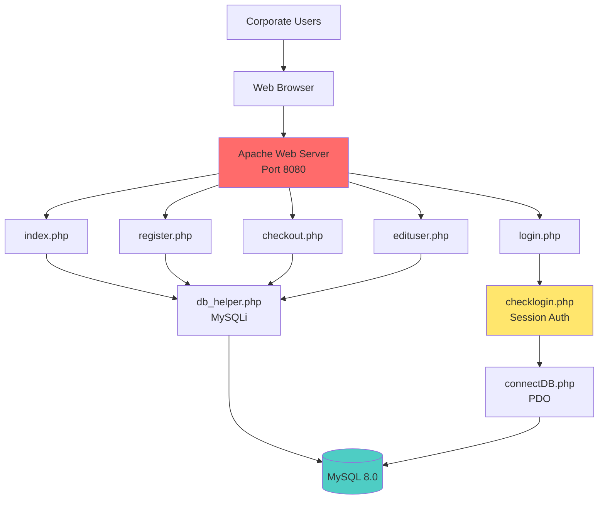
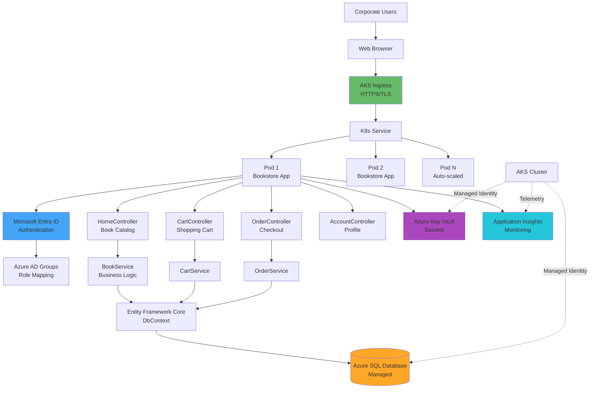
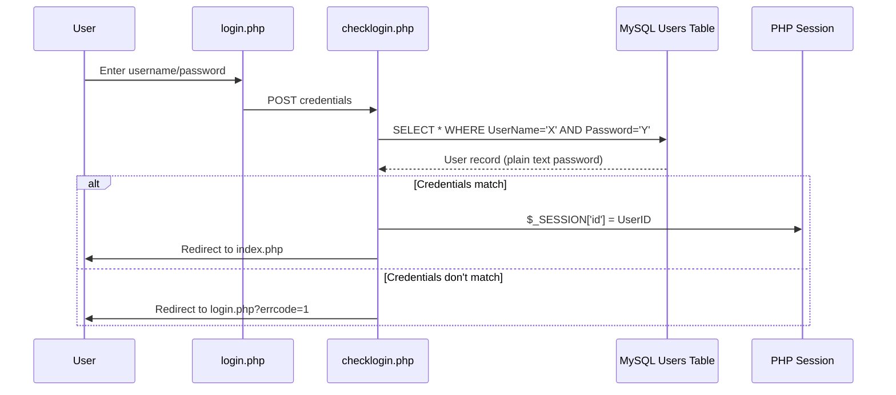
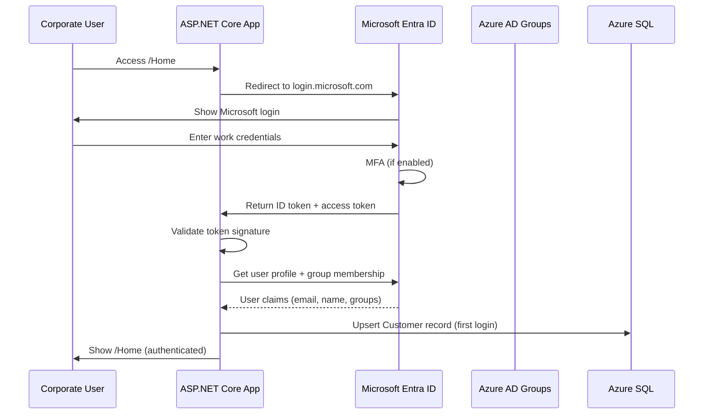
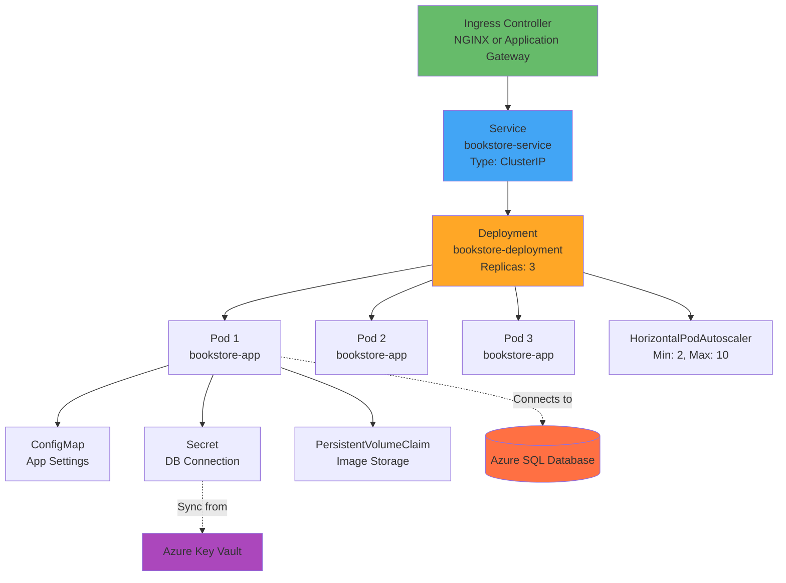

# Technical Assessment Report

**Application**: PHP Bookstore Website  
**Generated**: January 22, 2026  
**Phase**: 1 - Technical Assessment  
**Target**: .NET 10 Migration for Enterprise Deployment  

---

## Executive Summary

This technical assessment evaluates the migration of the PHP Bookstore Website to .NET 10 with enterprise-grade infrastructure. The application will be transformed from a vanilla PHP application with session-based authentication to an ASP.NET Core MVC application with Microsoft Entra ID (Azure AD) authentication, Entity Framework Core data access, and deployment on Azure Kubernetes Service (AKS).

**Key Assessment Findings:**
- ✅ **Low Complexity**: Simple procedural PHP code with clear business logic
- ⚠️ **Authentication Overhaul Required**: Complete redesign from username/password to Entra ID SSO
- ⚠️ **Database Migration**: MySQL to Azure SQL requires schema adjustments and connection changes
- ⚠️ **Infrastructure Complexity**: AKS requires proper containerization, networking, and orchestration
- ✅ **No Framework Dependencies**: No Laravel/Symfony-specific patterns to migrate
- 🔴 **Security Critical**: Current SQL injection vulnerabilities must be resolved

**Overall Risk**: Medium to High (primarily due to authentication redesign and AKS complexity)

---

## Migration Configuration

### Source Application

| Property | Value |
|----------|-------|
| **PHP Version** | 7.4 |
| **Framework** | Vanilla PHP (No Framework) |
| **Architecture** | Procedural, page-based |
| **Database** | MySQL 8.0 |
| **Authentication** | PHP Sessions + plain text passwords |
| **Database Driver** | MySQLi + PDO |
| **Hosting** | Docker (Apache + PHP 7.4) |
| **Lines of Code** | ~1,150 lines PHP |
| **Components** | 9 PHP files, 5 database tables |

### Target Architecture

| Property | Value |
|----------|-------|
| **.NET Version** | .NET 10 |
| **Architecture** | ASP.NET Core MVC |
| **Frontend** | Razor Views |
| **Data Access** | Entity Framework Core 10 |
| **Authentication** | Microsoft Entra ID (Azure AD) |
| **Authorization** | Role-based with Azure AD groups |
| **Azure Hosting** | Azure Kubernetes Service (AKS) |
| **IaC Tool** | Bicep |
| **Database** | Azure SQL Database |
| **Container** | Docker (multi-stage .NET 10) |
| **Orchestration** | Kubernetes (AKS) |
| **Security** | Azure Key Vault, Managed Identity |

---

## Architecture Transformation

### Current PHP Architecture



### Target .NET 10 Architecture



---

## Risk Assessment

### Critical Risks (🔴)

| Risk | Impact | Probability | Mitigation Strategy |
|------|--------|-------------|---------------------|
| **SQL Injection Vulnerabilities** | Critical - Data breach | High | Replace all string concatenation with EF Core parameterized queries |
| **Plain Text Passwords** | Critical - Security breach | High | Remove password storage entirely; Entra ID handles authentication |
| **Entra ID Tenant Configuration** | Blocker - App won't start | Medium | Document tenant setup, app registrations, redirect URIs in Phase 4 |
| **AKS Cluster Misconfiguration** | High - App unavailable | Medium | Use Bicep templates with best practices, enable Azure Policy |
| **Database Migration Data Loss** | Critical - Business continuity | Low | Create comprehensive backup, test migration in dev environment first |

### High Risks (🟠)

| Risk | Impact | Probability | Mitigation Strategy |
|------|--------|-------------|---------------------|
| **Entra ID User Provisioning** | High - No user access | High | Document user/group creation process, consider B2B guest access |
| **Authentication Logic Overhaul** | High - Breaks all auth | High | Complete redesign required; remove all session code, implement OAuth2 flow |
| **MySQL → Azure SQL Compatibility** | Medium - Query breaks | Medium | Test all queries; adjust for T-SQL differences (AUTO_INCREMENT → IDENTITY) |
| **Session State Migration** | Medium - Cart loss | Medium | Move to distributed cache (Redis) or database-backed sessions |
| **AKS Networking Complexity** | Medium - Connectivity issues | Medium | Use Azure CNI, document service mesh requirements |
| **No CSRF Tokens** | High - Security risk | High | ASP.NET Core provides built-in anti-forgery tokens |
| **Container Image Security** | Medium - Vulnerabilities | Medium | Scan images, use minimal base images, non-root user |

### Medium Risks (🟡)

| Risk | Impact | Probability | Mitigation Strategy |
|------|--------|-------------|---------------------|
| **Nested Validation Logic** | Medium - Hard to migrate | High | Refactor to Data Annotations + FluentValidation |
| **Inline HTML Generation** | Medium - Time consuming | High | Convert echo statements to Razor syntax systematically |
| **Mixed DB Drivers (PDO/MySQLi)** | Low - Inconsistency | Low | Consolidate to EF Core throughout |
| **No Unit Tests** | Medium - Regression risk | High | Write tests during migration for critical business logic |
| **Cart Total Calculation** | Low - Logic preservation | Low | Preserve calculation logic in C# service methods |
| **Image File Storage** | Low - Path differences | Medium | Use Azure Blob Storage or maintain local storage with volume mounts |
| **Environment Variables** | Low - Configuration | Low | Use Azure Key Vault and AKS ConfigMaps/Secrets |

### Low Risks (🟢)

| Risk | Impact | Probability | Mitigation Strategy |
|------|--------|-------------|---------------------|
| **Simple Database Schema** | Low | Low | Direct EF Core entity mapping, straightforward |
| **No External APIs** | Low | Low | No integration migration needed |
| **No Background Jobs** | Low | Low | No queue/worker migration needed |
| **Static Assets** | Low | Low | Copy to wwwroot, serve via ASP.NET Core static files |
| **Small Codebase** | Low | Low | Manageable migration scope |

---

## Authentication Redesign Analysis

### Current Authentication Flow



**Issues:**
- 🔴 Plain text password comparison
- 🔴 SQL injection vulnerability
- 🔴 No password hashing
- 🔴 No session regeneration (fixation risk)
- 🔴 No rate limiting (brute force risk)

### Target Entra ID Flow



**Benefits:**
- ✅ No password storage in app
- ✅ Enterprise SSO (single sign-on)
- ✅ MFA support (if enabled in tenant)
- ✅ Centralized user management
- ✅ Token-based authentication
- ✅ Group-based authorization

### Authentication Migration Strategy

| Current Component | Action | .NET 10 Implementation |
|-------------------|--------|------------------------|
| `login.php` | **Remove** | Entra ID login page (external) |
| `checklogin.php` | **Remove** | OAuth2 middleware handles auth |
| `register.php` | **Transform** | Optional self-service or admin provisioning in Azure AD |
| `logout.php` | **Replace** | AccountController.Logout() with Entra ID signout |
| `edituser.php` | **Simplify** | Profile view (read-only from Entra ID + custom fields) |
| `Users` table | **Deprecate** | UserName/Password columns unused; keep for Customer relationship |
| `$_SESSION['id']` | **Replace** | `User.Identity.Name` from claims |
| Session authentication | **Replace** | Cookie authentication with Entra ID tokens |

**New Components Required:**
1. **Entra ID App Registration** (in Azure Portal)
2. **`Microsoft.Identity.Web` NuGet package**
3. **`AccountController`** with Entra ID sign-in/sign-out
4. **Authorization policies** based on Azure AD groups
5. **`appsettings.json`** with tenant ID, client ID
6. **User profile mapping** (Entra ID → Customer table)

---

## Database Migration Assessment

### MySQL to Azure SQL Compatibility

| MySQL Feature | Azure SQL Equivalent | Action Required |
|---------------|---------------------|-----------------|
| `AUTO_INCREMENT` | `IDENTITY(1,1)` | EF Core handles automatically |
| `varchar(50)` | `NVARCHAR(50)` | EF Core uses NVARCHAR by default |
| `double(12,2)` | `DECIMAL(12,2)` | Use `[Column(TypeName = "decimal(12,2)")]` |
| Backtick identifiers | Square brackets | EF Core handles automatically |
| `CURRENT_TIME` | `GETDATE()` | Use C# `DateTime.Now` in code |
| `ON DELETE SET NULL` | Same | EF Core fluent API supports this |
| Table name `Order` | `[Order]` (reserved word) | EF Core escapes automatically or rename to `Orders` |

### Schema Migration Plan

**Step 1: Export MySQL data to CSV/JSON**
```sql
SELECT * FROM Book INTO OUTFILE 'books.csv';
-- Repeat for all tables
```

**Step 2: Create EF Core entities**
```csharp
public class Book
{
    public string BookId { get; set; }
    public string BookTitle { get; set; }
    public string ISBN { get; set; }
    [Column(TypeName = "decimal(12,2)")]
    public decimal Price { get; set; }
    public string Author { get; set; }
    public string Type { get; set; }
    public string Image { get; set; }
}
```

**Step 3: Generate migration**
```bash
dotnet ef migrations add InitialCreate
dotnet ef database update
```

**Step 4: Import data**
```csharp
// Use bulk insert or seeding
context.Books.AddRange(booksFromCsv);
context.SaveChanges();
```

### Data Migration Risks

| Risk | Mitigation |
|------|------------|
| **Data type mismatches** | Test conversion with sample data first |
| **Character encoding (UTF-8)** | Ensure NVARCHAR columns in Azure SQL |
| **Foreign key constraint violations** | Import in order: Users → Customer → Book → Cart/Order |
| **Downtime during migration** | Use blue-green deployment or read-only mode |

---

## Technology Mapping

### PHP to .NET Package Mapping

| PHP Package/Extension | Purpose | .NET 10 Equivalent | NuGet Package |
|----------------------|---------|-------------------|---------------|
| mysqli | MySQL database access | Entity Framework Core | Microsoft.EntityFrameworkCore.SqlServer |
| pdo_mysql | MySQL database access | Entity Framework Core | Microsoft.EntityFrameworkCore.SqlServer |
| PHP sessions | User authentication | Entra ID + cookies | Microsoft.Identity.Web |
| N/A | Password hashing | N/A (Entra ID handles) | - |
| htmlspecialchars() | XSS prevention | Razor automatic encoding | (Built-in) |
| filter_var() | Email validation | Data Annotations | System.ComponentModel.DataAnnotations |
| preg_match() | Regex validation | Regular expressions | System.Text.RegularExpressions |

### Code Pattern Mapping

| PHP Pattern | Example | C# / .NET 10 Equivalent | Example |
|-------------|---------|------------------------|---------|
| **Session access** | `$_SESSION['id']` | User claims | `User.FindFirst(ClaimTypes.NameIdentifier).Value` |
| **DB query** | `$conn->query($sql)` | LINQ | `context.Books.Where(b => b.BookId == id).FirstOrDefault()` |
| **Form POST** | `$_POST['name']` | Model binding | `public IActionResult Submit(OrderModel model)` |
| **Echo HTML** | `echo "<h1>Title</h1>";` | Razor syntax | `<h1>@Model.Title</h1>` |
| **Redirect** | `header("Location: index.php")` | RedirectToAction | `return RedirectToAction("Index", "Home")` |
| **Validation** | `preg_match("/^[a-zA-Z]*$/", $name)` | Data Annotations | `[RegularExpression(@"^[a-zA-Z\s]*$")]` |
| **Array** | `$books = array()` | List | `List<Book> books = new List<Book>()` |
| **String concat** | `"SELECT * FROM Users WHERE id=" . $id` | **Parameterized** | `context.Users.Where(u => u.UserId == id)` |
| **Include file** | `require_once 'db_helper.php'` | Using/DI | `private readonly BookstoreContext _context;` |

---

## Component Migration Mapping

### PHP Files → .NET 10 Structure

| PHP File | Lines | → | .NET 10 Component | Type | Estimated Effort |
|----------|-------|---|-------------------|------|------------------|
| **index.php** | 200 | → | `HomeController.cs` + `Index.cshtml` | Controller + View | 8 hours |
| **login.php** | 30 | → | **Removed** (Entra ID) + `Login.cshtml` | View only | 2 hours |
| **checklogin.php** | 30 | → | **Removed** (Middleware) | N/A | 1 hour |
| **register.php** | 200 | → | **Simplified** or **Removed** | See strategy below | 6 hours |
| **checkout.php** | 330 | → | `OrderController.cs` + `Checkout.cshtml` | Controller + View | 12 hours |
| **edituser.php** | 174 | → | `AccountController.cs` + `Profile.cshtml` | Controller + View | 6 hours |
| **logout.php** | 5 | → | `AccountController.Logout()` | Action method | 1 hour |
| **connectDB.php** | 10 | → | `BookstoreContext.cs` (EF Core) | DbContext | 3 hours |
| **db_helper.php** | 15 | → | `BookstoreContext.cs` (EF Core) | DbContext | - |
| **style.css** | 121 | → | `wwwroot/css/site.css` | Static file | 2 hours |
| **database.sql** | 64 | → | EF Core migrations | C# migration | 4 hours |

### New Components to Create

| Component | Purpose | Estimated Effort |
|-----------|---------|------------------|
| **Program.cs** | App configuration, DI, middleware | 4 hours |
| **appsettings.json** | Configuration (Entra ID, DB connection) | 2 hours |
| **Models/** (5 classes) | Book, User, Customer, Order, Cart entities | 6 hours |
| **Services/** (3 classes) | BookService, CartService, OrderService | 10 hours |
| **ViewModels/** (4 classes) | DTOs for views | 4 hours |
| **Dockerfile** | Multi-stage .NET build | 3 hours |
| **Kubernetes manifests** | Deployment, Service, Ingress | 8 hours |
| **Bicep templates** | AKS, Azure SQL, Key Vault, etc. | 16 hours |
| **Unit tests** | Critical business logic tests | 12 hours |
| **Integration tests** | API/controller tests | 8 hours |

---

## Registration Strategy with Entra ID

### Challenge: Self-Service Registration

Your current app allows public user registration. Entra ID is designed for existing organizational users. Here are migration options:

#### **Option 1: Admin-Provisioned Users Only** (Recommended for Enterprise)
- **Flow**: IT admin creates users in Azure AD before they can access the app
- **Pros**: Maximum security, full control, standard Entra ID flow
- **Cons**: No self-service, requires admin overhead
- **Best for**: B2B scenarios with known corporate customers

#### **Option 2: Azure AD B2C (Business-to-Consumer)**
- **Flow**: Self-service registration with email verification, Entra ID manages identities
- **Pros**: Supports self-registration, social logins, MFA
- **Cons**: Separate Azure AD B2C tenant, different configuration
- **Best for**: Public users + corporate users mixed

#### **Option 3: Hybrid - Local Registration + Entra ID SSO**
- **Flow**: Self-registered users stored locally; corporate users via Entra ID
- **Pros**: Supports both scenarios
- **Cons**: Two authentication paths, more complex
- **Best for**: Mixed user base

#### **Option 4: Invitation-Based**
- **Flow**: Users request access → admin sends Azure AD B2B invitation
- **Pros**: Controlled onboarding, uses Entra ID
- **Cons**: Manual approval step
- **Best for**: Vetted customers only

### Recommended Approach for Your Scenario

Given you have **corporate customers**, I recommend:

**Primary: Entra ID (Option 1)** for corporate SSO  
**Fallback: Azure AD B2C (Option 2)** if self-service is required

**Implementation in Migration:**
- Phase 3: Implement Entra ID authentication
- Phase 3: Create admin portal for user provisioning (if Option 1)
- Phase 3: Or configure Azure AD B2C tenant (if Option 2)
- Phase 4: Document user onboarding process in deployment guide

---

## AKS Deployment Architecture

### Kubernetes Resources Required



### Kubernetes Manifest Structure

| File | Purpose | Key Configuration |
|------|---------|-------------------|
| **deployment.yaml** | App deployment | replicas: 3, image, resources, health checks |
| **service.yaml** | Internal networking | ClusterIP, port 80 → 8080 |
| **ingress.yaml** | External access | TLS certificate, routing rules |
| **configmap.yaml** | Non-sensitive config | App settings, feature flags |
| **secret.yaml** | Sensitive data | DB connection (synced from Key Vault) |
| **hpa.yaml** | Auto-scaling | CPU: 70%, memory: 80% |
| **pvc.yaml** | Persistent storage | For uploaded images (optional) |

### AKS Cluster Configuration

| Setting | Value | Rationale |
|---------|-------|-----------|
| **Node Pool** | Standard_D2s_v3 (2 vCPU, 8GB RAM) | Balanced for web apps |
| **Node Count** | 3-5 nodes | High availability across zones |
| **Network Plugin** | Azure CNI | Better integration with Azure services |
| **Network Policy** | Azure Network Policy or Calico | Security isolation |
| **Managed Identity** | Enabled | Secure access to Azure SQL, Key Vault |
| **Azure Monitor** | Enabled | Container insights, log analytics |
| **Azure Policy** | Enabled | Compliance (e.g., no privileged containers) |
| **Ingress** | Application Gateway Ingress Controller (AGIC) | WAF, SSL offloading |
| **Container Registry** | Azure Container Registry (ACR) | Private image storage |

---

## Migration Complexity Estimate

### Effort Breakdown by Component

| Component | Count | Complexity | Estimated Effort | Notes |
|-----------|-------|------------|------------------|-------|
| **Controllers** | 4 new | Medium | 24 hours | Home, Cart, Order, Account |
| **Entities (Models)** | 5 | Low | 6 hours | Book, User, Customer, Order, Cart |
| **Services** | 3 | Medium | 10 hours | Business logic extraction |
| **Razor Views** | 6 | Medium | 16 hours | Convert inline PHP/HTML to Razor |
| **Database Migration** | 5 tables | Medium | 8 hours | Schema + data migration |
| **Entra ID Integration** | 1 | High | 12 hours | App registration, authentication flow |
| **EF Core Setup** | 1 | Low | 6 hours | DbContext, configuration |
| **Authentication Redesign** | N/A | High | 16 hours | Remove sessions, implement OAuth2 |
| **Validation Refactoring** | All forms | Medium | 8 hours | Data Annotations, FluentValidation |
| **Unit Tests** | Critical paths | Medium | 12 hours | Services, business logic |
| **Integration Tests** | Controllers | Medium | 8 hours | API testing |
| **Dockerfile** | 1 | Low | 3 hours | Multi-stage build |
| **Kubernetes Manifests** | 7 files | High | 12 hours | Deployment, service, ingress, etc. |
| **Bicep Templates** | Infrastructure | High | 20 hours | AKS, SQL, Key Vault, networking |
| **CI/CD Pipeline** | GitHub Actions or Azure DevOps | Medium | 10 hours | Build, test, deploy to AKS |
| **Security Hardening** | Throughout | Medium | 8 hours | HTTPS, secrets, RBAC |
| **Documentation** | User & admin guides | Low | 6 hours | Deployment, operation guides |
| **Testing & Validation** | End-to-end | Medium | 12 hours | Full flow testing |

### Total Effort Summary

| Category | Estimated Hours |
|----------|----------------|
| **Core Development** | 70 hours |
| **Authentication & Security** | 36 hours |
| **Infrastructure & DevOps** | 45 hours |
| **Testing** | 32 hours |
| **Documentation** | 6 hours |
| **Contingency (20%)** | 38 hours |
| **Total** | **227 hours** (~6 weeks at 40 hrs/week) |

### Complexity Rating by Phase

| Phase | Complexity | Duration |
|-------|------------|----------|
| Phase 2: Migration Plan | Low | 4 hours |
| Phase 3: Code Migration | High | 90 hours |
| Phase 4: Infrastructure | High | 45 hours |
| Phase 5: Deployment | Medium | 20 hours |
| Phase 6: CI/CD | Medium | 10 hours |
| Testing & Refinement | Medium | 58 hours |

---

## Security Improvements

### Current Vulnerabilities → .NET 10 Fixes

| Vulnerability | Current State | .NET 10 Solution |
|---------------|---------------|------------------|
| **SQL Injection** | 🔴 Critical | ✅ EF Core parameterized queries (automatic) |
| **Plain Text Passwords** | 🔴 Critical | ✅ Removed (Entra ID manages passwords) |
| **No Password Policy** | 🔴 Critical | ✅ Azure AD password policies |
| **Session Fixation** | 🟠 High | ✅ Token-based auth, no session fixation risk |
| **XSS** | 🟡 Medium | ✅ Razor automatic HTML encoding |
| **CSRF** | 🟠 High | ✅ Anti-forgery tokens (built-in) |
| **No HTTPS** | 🟡 Medium | ✅ HTTPS enforced, TLS at ingress |
| **Exposed Errors** | 🟡 Medium | ✅ Custom error pages, logging to App Insights |
| **No Rate Limiting** | 🟡 Medium | ✅ AGIC rate limiting + Azure Front Door |
| **Predictable Sessions** | 🟡 Medium | ✅ Cryptographically secure tokens |

### Additional Security Enhancements

- ✅ **Azure Key Vault** for secrets management
- ✅ **Managed Identity** for passwordless database access
- ✅ **Azure Policy** enforcement on AKS
- ✅ **Network Security Groups** for traffic filtering
- ✅ **Private Endpoints** for Azure SQL (optional)
- ✅ **Container image scanning** in ACR
- ✅ **Azure AD Conditional Access** policies
- ✅ **MFA enforcement** (Azure AD setting)
- ✅ **Application Insights** for security monitoring
- ✅ **Azure Defender for Containers** (optional)

---

## Prerequisites for Migration

Before proceeding to Phase 2 (Migration Planning), ensure:

### Development Environment
- [ ] **.NET 10 SDK installed** (dotnet 10.0.x)
- [ ] **Visual Studio 2025** or **VS Code with C# Dev Kit**
- [ ] **Docker Desktop** for local containerization
- [ ] **Azure CLI** (az) installed and authenticated
- [ ] **kubectl** for Kubernetes management
- [ ] **Git** for version control

### Azure Resources
- [ ] **Azure subscription** with Owner or Contributor role
- [ ] **Azure AD tenant** for Entra ID configuration
- [ ] **Permission to create app registrations** in Azure AD
- [ ] **Sufficient quota** for AKS cluster (5+ cores)
- [ ] **Azure Container Registry** (will be created in Phase 4)

### Access & Permissions
- [ ] **Azure AD admin access** for app registration
- [ ] **Permission to create Azure AD groups** for role-based access
- [ ] **Ability to invite/add users** to Azure AD tenant
- [ ] **AKS cluster admin** permissions

### Documentation & Planning
- [ ] **Corporate customer list** for Azure AD provisioning
- [ ] **Azure AD group structure** defined (e.g., Bookstore_Users, Bookstore_Admins)
- [ ] **DNS domain** for custom domain (optional but recommended)
- [ ] **SSL certificate** or use Azure-managed certificate

---

## Entra ID Configuration Requirements

### App Registration Setup

You'll need to create an **Azure AD App Registration** with:

| Setting | Value |
|---------|-------|
| **Name** | BookstoreApp |
| **Supported account types** | Single tenant (your organization only) |
| **Redirect URIs** | https://yourdomain.com/signin-oidc |
| **Front-channel logout URL** | https://yourdomain.com/signout-oidc |
| **ID tokens** | Enabled |
| **Access tokens** | Enabled |

### API Permissions Required

- `User.Read` (Microsoft Graph) - Read user profile
- `Directory.Read.All` (Microsoft Graph) - Read directory data (optional for groups)

### Azure AD Groups (Role Mapping)

| Azure AD Group | App Role | Permissions |
|----------------|----------|-------------|
| **Bookstore_Users** | User | Browse books, create orders |
| **Bookstore_Admins** | Admin | Manage books, view all orders |

### App Settings to Configure

```json
{
  "AzureAd": {
    "Instance": "https://login.microsoftonline.com/",
    "Domain": "yourcompany.onmicrosoft.com",
    "TenantId": "your-tenant-id",
    "ClientId": "your-client-id",
    "ClientSecret": "stored-in-key-vault",
    "CallbackPath": "/signin-oidc",
    "SignedOutCallbackPath": "/signout-oidc"
  }
}
```

---

## Database Schema Changes

### Required Modifications

| Table | Current | Change | Reason |
|-------|---------|--------|--------|
| **Users** | `UserName VARCHAR(128)` | Keep but unused | Entra ID provides identity |
| **Users** | `Password VARCHAR(16)` | Remove or null | No passwords stored |
| **Users** | - | Add `AzureAdObjectId UNIQUEIDENTIFIER` | Link to Entra ID user |
| **Users** | - | Add `Email NVARCHAR(256)` | From Entra ID claims |
| **Customer** | `CustomerEmail VARCHAR(200)` | Change to `NVARCHAR(256)` | Unicode support |
| **Book** | `BookID VARCHAR(50)` | Keep or change to INT | Consider numeric IDs |
| **Order** | Table name | Rename to `Orders` | Avoid reserved keyword |
| All | `double(12,2)` | Change to `DECIMAL(12,2)` | Precision preservation |

### Updated Schema (Azure SQL)

```sql
CREATE TABLE Users (
    UserID INT IDENTITY(1,1) PRIMARY KEY,
    AzureAdObjectId UNIQUEIDENTIFIER UNIQUE NOT NULL,
    Email NVARCHAR(256) NOT NULL,
    UserName NVARCHAR(128), -- Legacy, can be null
    CreatedAt DATETIME2 DEFAULT GETDATE()
);

CREATE TABLE Customer (
    CustomerID INT IDENTITY(1,1) PRIMARY KEY,
    CustomerName NVARCHAR(128),
    CustomerPhone NVARCHAR(20),
    CustomerIC NVARCHAR(20),
    CustomerEmail NVARCHAR(256),
    CustomerAddress NVARCHAR(500),
    CustomerGender NVARCHAR(10),
    UserID INT,
    FOREIGN KEY (UserID) REFERENCES Users(UserID) ON DELETE SET NULL
);

CREATE TABLE Book (
    BookID NVARCHAR(50) PRIMARY KEY,
    BookTitle NVARCHAR(200),
    ISBN NVARCHAR(20),
    Price DECIMAL(12,2),
    Author NVARCHAR(128),
    Type NVARCHAR(128),
    Image NVARCHAR(256)
);

CREATE TABLE Orders (
    OrderID INT IDENTITY(1,1) PRIMARY KEY,
    CustomerID INT,
    BookID NVARCHAR(50),
    DatePurchase DATETIME2,
    Quantity INT,
    TotalPrice DECIMAL(12,2),
    Status NVARCHAR(1),
    FOREIGN KEY (CustomerID) REFERENCES Customer(CustomerID) ON DELETE SET NULL,
    FOREIGN KEY (BookID) REFERENCES Book(BookID) ON DELETE SET NULL
);

CREATE TABLE Cart (
    CartID INT IDENTITY(1,1) PRIMARY KEY,
    CustomerID INT,
    BookID NVARCHAR(50),
    Price DECIMAL(12,2),
    Quantity INT,
    TotalPrice DECIMAL(12,2),
    FOREIGN KEY (CustomerID) REFERENCES Customer(CustomerID) ON DELETE SET NULL,
    FOREIGN KEY (BookID) REFERENCES Book(BookID) ON DELETE SET NULL
);
```

---

## Next Steps

✅ **Phase 1 Complete - Technical Assessment**

You are now ready to proceed to **Phase 2: Migration Planning**.

Run the command: **`/phase2-createmigrationplan`**

### What Phase 2 Will Deliver

Phase 2 will create a **detailed file-by-file migration plan** that includes:

1. **Method-level mapping** - Every PHP function → C# method
2. **Business rule tracking** - Source location → target location
3. **Migration order (waves)** - Dependencies-first approach
4. **Component relationships** - How pieces connect in .NET
5. **Validation checklist** - How to verify each migration step
6. **Code templates** - Sample C# implementations

### Expected Phase 2 Output

- `reports/Migration-Plan-Detailed.md` - Complete migration blueprint
- Wave-by-wave migration strategy
- Detailed component mapping table
- Ready to execute in Phase 3

---

**Report Generated**: January 22, 2026  
**Assessment Confidence**: High  
**Recommendation**: Proceed with migration plan creation  
**Estimated Total Effort**: 227 hours (~6 weeks)  
**Risk Level**: Medium-High (manageable with proper planning)
